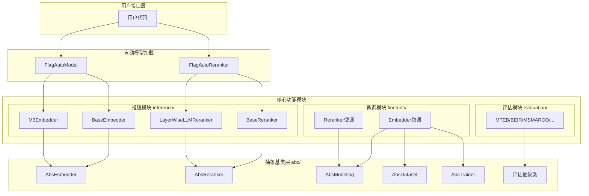

# FlagEmbedding 项目概述

## 项目架构总览

本文档为 FlagEmbedding (BGE) 项目提供整体架构概览、核心设计理念和快速入门指南。



### 文档导航

| 章节 | 内容说明 | 适用对象 |
|------|---------|---------|
| [1. 项目背景](#1-项目背景与定位) | 项目起源、定位与核心价值 | 初次接触项目 |
| [2. 设计理念](#2-设计理念与架构思想) | 架构思想、设计模式 | 架构师、开发者 |
| [3. 目录结构](#3-目录结构说明) | 核心目录与职责划分 | 所有用户 |
| [4. 功能模型](#4-主要功能与模型列表) | 支持的模型与功能列表 | 算法工程师 |
| [5. 快速开始](#5-快速开始示例) | 基础使用代码示例 | 开发者 |
| [6. 核心特性](#6-核心特性总结) | 项目亮点总结 | 所有用户 |

---

## 1. 项目背景与定位

### 1.1 什么是 FlagEmbedding

FlagEmbedding 是一个开源的嵌入模型（Embedding）和重排序模型（Reranker）框架，由北京智源人工智能研究院（BAAI）开发并维护。该项目提供了一套完整的工具链，用于训练、评估和推理高质量的文本嵌入模型，特别专注于信息检索、语义搜索、问答系统等自然语言处理任务。

### 1.2 开发机构与项目定位

- **开发机构**：北京智源人工智能研究院（BAAI）
- **核心产品**：BGE (BAAI General Embedding) 系列模型
- **主要目标**：
  - 提供性能领先的嵌入模型和重排序模型
  - 支持多种模型架构（Encoder-only 和 Decoder-only）
  - 提供易于使用的推理、微调和评估工具
  - 支持多语言、多功能、多粒度的嵌入表示

### 1.3 解决的核心问题

FlagEmbedding 主要解决以下问题：
- 高质量文本嵌入的生成与推理
- 检索任务中的文本相关性重排序
- 不同架构模型的统一接口封装
- 模型微调与评估的标准化流程

## 2. 设计理念与架构思想

### 2.1 模块化架构设计

FlagEmbedding 采用高度模块化的设计思路，将系统划分为三个核心模块：

1. **抽象基类层（abc/）**：定义统一的接口规范
2. **推理模块（inference/）**：负责模型加载与前向推理
3. **微调模块（finetune/）**：提供模型训练与微调能力
4. **评估模块（evaluation/）**：支持多基准模型性能评估

### 2.2 抽象基类模式

项目采用抽象基类（ABC）模式定义核心接口：

- [AbsEmbedder](file:///workspace/FlagEmbedding/abc/inference/AbsEmbedder.py)：嵌入模型的抽象基类，定义了 encode、encode_queries、encode_corpus 等核心方法
- [AbsReranker](file:///workspace/FlagEmbedding/abc/inference/AbsReranker.py)：重排序模型的抽象基类
- 微调相关的抽象基类：AbsModeling、AbsDataset、AbsTrainer、AbsRunner

这种设计使得不同架构的模型（如 Encoder-only 和 Decoder-only）可以实现统一的接口，方便用户使用和扩展。

### 2.3 自动模型加载机制

通过 [FlagAutoModel](file:///workspace/FlagEmbedding/inference/auto_embedder.py) 和 [FlagAutoReranker](file:///workspace/FlagEmbedding/inference/auto_reranker.py) 类，项目实现了智能模型加载：
- 根据模型名称自动选择对应的实现类
- 支持从 HuggingFace Hub 或本地路径加载模型
- 自动处理模型配置与参数设置

### 2.4 多设备与多进程支持

[AbsEmbedder](file:///workspace/FlagEmbedding/abc/inference/AbsEmbedder.py) 基类内置了：
- 多设备自动检测与支持（CUDA、NPU、MUSA、MPS、CPU）
- 多进程并行推理能力
- 内存优化与 OOM 处理机制

## 3. 目录结构说明

```
/workspace/FlagEmbedding/
├── abc/                          # 抽象基类定义
│   ├── inference/                # 推理抽象基类
│   │   ├── AbsEmbedder.py        # 嵌入模型基类
│   │   ├── AbsReranker.py        # 重排序模型基类
│   │   └── __init__.py
│   ├── finetune/                 # 微调抽象基类
│   │   ├── embedder/             # 嵌入模型微调基类
│   │   ├── reranker/             # 重排序模型微调基类
│   │   └── __init__.py
│   ├── evaluation/               # 评估抽象基类
│   └── __init__.py
├── inference/                    # 推理模块实现
│   ├── auto_embedder.py          # 自动嵌入模型加载器
│   ├── auto_reranker.py          # 自动重排序模型加载器
│   ├── embedder/                 # 嵌入模型实现
│   │   ├── encoder_only/         # Encoder-only 模型
│   │   │   ├── base.py           # 基础嵌入模型
│   │   │   └── m3.py             # BGE-M3 特殊实现
│   │   ├── decoder_only/         # Decoder-only 模型
│   │   │   ├── base.py
│   │   │   ├── icl.py            # 上下文学习支持
│   │   │   └── pseudo_moe.py     # 伪 MoE 实现
│   │   ├── model_mapping.py      # 模型名称映射配置
│   │   └── __init__.py
│   ├── reranker/                 # 重排序模型实现
│   │   ├── encoder_only/
│   │   ├── decoder_only/
│   │   ├── model_mapping.py
│   │   └── __init__.py
│   └── __init__.py
├── finetune/                     # 微调模块
│   ├── embedder/                 # 嵌入模型微调
│   ├── reranker/                 # 重排序模型微调
│   └── __init__.py
├── evaluation/                   # 评估模块
│   ├── mteb/                     # MTEB 基准
│   ├── beir/                     # BEIR 基准
│   ├── msmarco/                  # MSMARCO 基准
│   ├── miracl/                   # MIRACL 基准
│   ├── mkqa/                     # MKQA 基准
│   ├── mldr/                     # MLDR 基准
│   ├── air_bench/                # AIR-Bench 基准
│   ├── bright/                   # BRIGHT 基准
│   ├── custom/                   # 自定义评估
│   └── __init__.py
├── utils/                        # 工具函数
│   ├── transformers_compat.py    # Transformers 兼容性处理
│   └── __init__.py
└── __init__.py
```

### 3.1 核心目录职责

| 目录 | 职责 |
|------|------|
| abc/ | 定义所有模块的抽象基类和接口规范 |
| inference/ | 提供模型推理能力，支持多种预训练模型 |
| finetune/ | 提供模型微调和训练功能 |
| evaluation/ | 支持多种标准基准的模型评估 |
| utils/ | 通用工具函数和兼容性处理 |

## 4. 主要功能与模型列表

### 4.1 支持的嵌入模型

FlagEmbedding 支持多种主流嵌入模型，包括：

#### BGE 系列（项目核心模型）
- **bge-m3**：多语言、多功能、多粒度嵌入模型
- **bge-large/ base/ small-en-v1.5**：英文 v1.5 版本
- **bge-large/ base/ small-zh-v1.5**：中文 v1.5 版本
- **bge-en-icl**：支持上下文学习的英文嵌入
- **bge-multilingual-gemma2**：基于 Gemma2 的多语言模型
- **bge-code-v1**：代码嵌入模型
- **bge-reasoner-embed-qwen3-8b-0923**：推理增强嵌入

#### 其他支持的模型系列
- **Qwen3-Embedding**：Qwen3 嵌入模型系列
- **E5**：Microsoft E5 系列模型
- **GTE**：阿里巴巴 GTE 系列模型
- **SFR**：Salesforce SFR 嵌入模型
- **Linq**：Linq 嵌入模型
- **BCE**：BCE 嵌入模型

完整模型列表请参考 [model_mapping.py](file:///workspace/FlagEmbedding/inference/embedder/model_mapping.py)。

### 4.2 支持的重排序模型

- **bge-reranker-base**：基础重排序模型
- **bge-reranker-large**：大型重排序模型
- **bge-reranker-v2-m3**：M3 版本重排序模型
- **bge-reranker-v2-gemma**：基于 Gemma 的重排序模型
- **bge-reranker-v2-minicpm-layerwise**：分层重排序模型
- **bge-reranker-v2.5-gemma2-lightweight**：轻量级重排序模型

完整列表请参考 [reranker/model_mapping.py](file:///workspace/FlagEmbedding/inference/reranker/model_mapping.py)。

### 4.3 主要研究项目

除了 BGE 系列，FlagEmbedding 还包含多个研究项目：

1. **BGE-M3**：多语言、多功能、多粒度嵌入
2. **LM-Cocktail**：模型混合技术
3. **LLM-Embedder**：大语言模型嵌入
4. **Activation-Beacon**：激活信标技术

### 4.4 支持的评估基准

项目支持多种主流评估基准：
- **MTEB**：大规模多语言嵌入基准
- **BEIR**：异构检索基准
- **MSMARCO**：微软机器阅读理解数据集
- **MIRACL**：多语言信息检索基准
- **MKQA**：多语言知识问答
- **MLDR**：多语言长文档检索
- **AIR-Bench**：实际应用场景检索基准
- **BRIGHT**：双语检索基准

## 5. 快速开始示例

### 5.1 基本嵌入推理

使用 FlagAutoModel 自动加载模型：

```python
from FlagEmbedding import FlagAutoModel

# 加载 BGE-M3 模型
model = FlagAutoModel.from_finetuned(
    'BAAI/bge-m3',
    normalize_embeddings=True,
    use_fp16=True
)

# 编码查询
queries = ['什么是人工智能？', '如何学习编程？']
query_embeddings = model.encode_queries(queries)

# 编码文档
corpus = [
    '人工智能是计算机科学的一个分支',
    '编程需要学习算法和数据结构'
]
corpus_embeddings = model.encode_corpus(corpus)
```

### 5.2 使用重排序模型

```python
from FlagEmbedding import FlagAutoReranker

# 加载重排序模型
reranker = FlagAutoReranker.from_finetuned('BAAI/bge-reranker-large')

# 计算查询与文档的相关性分数
scores = reranker.compute_score(
    [('什么是人工智能？', '人工智能是计算机科学的一个分支'),
     ('什么是人工智能？', '今天天气很好')]
)
```

### 5.3 多设备并行推理

```python
from FlagEmbedding import FlagAutoModel

# 指定多个 GPU 设备
model = FlagAutoModel.from_finetuned(
    'BAAI/bge-large-en-v1.5',
    devices=[0, 1, 2, 3]  # 使用 4 个 GPU
)

# 大规模批量编码
embeddings = model.encode(large_corpus, batch_size=1024)
```

## 6. 核心特性总结

1. **统一接口**：通过抽象基类实现不同架构模型的统一接口
2. **自动加载**：FlagAutoModel 和 FlagAutoReranker 简化模型使用
3. **多设备支持**：支持 CUDA、NPU、MUSA、MPS、CPU 等多种设备
4. **并行推理**：内置多进程并行，充分利用多 GPU
5. **完整工具链**：从推理、微调到评估的完整流程
6. **丰富模型库**：支持 BGE、E5、GTE、Qwen3 等多种主流模型
7. **研究导向**：持续集成最新的研究成果和优化技术

## 7. 下一步

- 深入了解 [抽象基类层](./02_abc_layer.md) 的设计
- 学习 [推理模块](./03_inference_module.md) 的具体实现
- 探索 [微调模块](./04_finetune_module.md) 的使用方法
- 了解 [评估模块](./05_evaluation_module.md) 的评估流程
