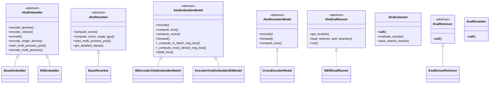

# FlagEmbedding 抽象基层 (ABC Layer) 深度分析

## 模块架构总览



### 核心组件速查表

| 组件 | 职责 | 关键方法 | 实现文件 |
|------|------|---------|---------|
| **AbsEmbedder** | 嵌入模型抽象 | encode/encode_queries/encode_corpus | abc/inference/AbsEmbedder.py |
| **AbsReranker** | 重排序模型抽象 | compute_score | abc/inference/AbsReranker.py |
| **AbsEmbedderModel** | 训练模型抽象 | forward/loss 计算 | abc/finetune/embedder/AbsModeling.py |
| **AbsRerankerModel** | 重排序训练抽象 | forward | abc/finetune/reranker/AbsModeling.py |
| **AbsEvalRunner** | 评估运行器 | run | abc/evaluation/runner.py |
| **AbsEvaluator** | 评估执行器 | __call__ | abc/evaluation/evaluator.py |

---

## 目录

- [1. 概述](#1-概述)
- [2. 推理抽象基类](#2-推理抽象基类)
  - [2.1 AbsEmbedder](#21-absembedder)
  - [2.2 AbsReranker](#22-absreranker)
- [3. 微调抽象基类](#3-微调抽象基类)
  - [3.1 Embedder 微调抽象类](#31-embedder-微调抽象类)
  - [3.2 Reranker 微调抽象类](#32-reranker-微调抽象类)
- [4. 评估抽象基类](#4-评估抽象基类)
  - [4.1 AbsEvalRunner](#41-absevalrunner)
  - [4.2 AbsEvaluator](#42-absevaluator)
  - [4.3 AbsEvalDataLoader](#43-absevaldataloader)
  - [4.4 检索器相关](#44-检索器相关)
- [5. 设计模式与架构思想](#5-设计模式与架构思想)

---

## 1. 概述

FlagEmbedding 项目采用了清晰的分层架构设计，其中抽象基层 (ABC Layer) 是整个框架的核心。该层定义了：

- **推理接口**: 统一的 embedding 和 reranking 推理接口
- **训练流程**: 标准化的微调训练流程
- **评估框架**: 可扩展的评估基础设施

这种设计使得框架具有高度的可扩展性，支持多种模型架构（encoder-only、decoder-only 等），同时保持统一的用户接口。

### 目录结构

```
abc/
├── inference/              # 推理抽象基类
│   ├── AbsEmbedder.py
│   └── AbsReranker.py
├── finetune/               # 微调抽象基类
│   ├── embedder/
│   │   ├── AbsModeling.py
│   │   ├── AbsDataset.py
│   │   ├── AbsTrainer.py
│   │   ├── AbsRunner.py
│   │   └── AbsArguments.py
│   └── reranker/
│       ├── AbsModeling.py
│       ├── AbsDataset.py
│       ├── AbsTrainer.py
│       ├── AbsRunner.py
│       └── AbsArguments.py
└── evaluation/             # 评估抽象基类
    ├── runner.py
    ├── evaluator.py
    ├── data_loader.py
    ├── searcher.py
    ├── arguments.py
    └── utils.py
```

---

## 2. 推理抽象基类

### 2.1 AbsEmbedder

**文件位置**: [abc/inference/AbsEmbedder.py](file:///workspace/FlagEmbedding/abc/inference/AbsEmbedder.py)

`AbsEmbedder` 是所有嵌入模型的抽象基类，提供了统一的文本编码接口。

#### 核心设计

```python
class AbsEmbedder(ABC):
    def __init__(
        self,
        model_name_or_path: str,
        normalize_embeddings: bool = True,
        use_fp16: bool = True,
        use_bf16: bool = False,
        query_instruction_for_retrieval: Optional[str] = None,
        query_instruction_format: str = "{}{}",
        devices: Optional[Union[str, int, List[str], List[int]]] = None,
        batch_size: int = 256,
        query_max_length: int = 512,
        passage_max_length: int = 512,
        convert_to_numpy: bool = True,
        truncate_dim: Optional[int] = None,
        **kwargs: Any,
    ):
```

**关键参数**:
- `normalize_embeddings`: 是否归一化嵌入向量
- `use_fp16` / `use_bf16`: 混合精度推理支持
- `devices`: 支持多设备（GPU/TPU/NPU/Musa）分布式推理
- `truncate_dim`: 支持 Matryoshka Representation Learning (MRL) 的维度截断

#### 核心接口方法

##### 1. 主要编码接口

```python
def encode_queries(
    self,
    queries: Union[List[str], str],
    batch_size: Optional[int] = None,
    max_length: Optional[int] = None,
    convert_to_numpy: Optional[bool] = None,
    **kwargs: Any
)
```

专门用于编码查询文本，会自动应用 `query_instruction_for_retrieval`。

```python
def encode_corpus(
    self,
    corpus: Union[List[str], str],
    batch_size: Optional[int] = None,
    max_length: Optional[int] = None,
    convert_to_numpy: Optional[bool] = None,
    **kwargs: Any
)
```

专门用于编码语料文本，支持可选的 `passage_instruction_for_retrieval`。

```python
def encode(
    self,
    sentences: Union[List[str], str],
    batch_size: Optional[int] = None,
    max_length: Optional[int] = None,
    convert_to_numpy: Optional[bool] = None,
    instruction: Optional[str] = None,
    instruction_format: Optional[str] = None,
    **kwargs: Any
)
```

通用编码方法，是 `encode_queries` 和 `encode_corpus` 的基础。

##### 2. 抽象方法（子类必须实现）

```python
@abstractmethod
def encode_single_device(
    self,
    sentences: Union[List[str], str],
    batch_size: int = 256,
    max_length: int = 512,
    convert_to_numpy: bool = True,
    device: Optional[str] = None,
    **kwargs: Any,
):
    """子类必须实现的单设备编码方法"""
    pass
```

#### 多设备并行推理机制

`AbsEmbedder` 实现了高效的多进程多设备并行推理：

##### 核心流程

1. **启动多进程池** ([start_multi_process_pool](file:///workspace/FlagEmbedding/abc/inference/AbsEmbedder.py#L319))
   - 使用 `spawn` 上下文创建子进程
   - 模型共享内存，避免重复加载
   - 每个设备对应一个工作进程

```python
def start_multi_process_pool(
    self,
    process_target_func: Any,
) -> Dict[Literal["input", "output", "processes"], Any]:
    # 模型移到 CPU 并共享内存
    self.model.to("cpu")
    self.model.share_memory()
    
    # 使用 spawn 上下文
    ctx = mp.get_context("spawn")
    input_queue = ctx.Queue()
    output_queue = ctx.Queue()
    processes = []
    
    # 为每个设备创建进程
    for device_id in self.target_devices:
        p = ctx.Process(
            target=process_target_func,
            args=(device_id, self, input_queue, output_queue),
            daemon=True,
        )
        p.start()
        processes.append(p)
```

2. **工作进程函数** ([_encode_multi_process_worker](file:///workspace/FlagEmbedding/abc/inference/AbsEmbedder.py#L359))
   - 从输入队列获取任务
   - 调用 `encode_single_device` 执行
   - 将结果放回输出队列

3. **分发与收集** ([encode_multi_process](file:///workspace/FlagEmbedding/abc/inference/AbsEmbedder.py#L404))
   - 将输入均匀分块
   - 发送到各进程
   - 收集结果并按原始顺序重组

```python
def encode_multi_process(
    self,
    sentences: List[str],
    pool: Dict[Literal["input", "output", "processes"], Any],
    **kwargs
):
    # 计算分块大小
    chunk_size = math.ceil(len(sentences) / len(pool["processes"]))
    
    # 分发任务
    input_queue = pool["input"]
    last_chunk_id = 0
    chunk = []
    for sentence in sentences:
        chunk.append(sentence)
        if len(chunk) >= chunk_size:
            input_queue.put([last_chunk_id, chunk, kwargs])
            last_chunk_id += 1
            chunk = []
    # ... 处理剩余部分
    
    # 收集并排序结果
    results_list = sorted(
        [output_queue.get() for _ in trange(last_chunk_id)],
        key=lambda x: x[0],
    )
    # 合并结果
    return self._concatenate_results_from_multi_process([result[1] for result in results_list])
```

4. **资源管理**
   - `stop_self_pool`: 清理进程池和 GPU 缓存
   - `__del__`: 析构函数自动清理

#### 设备支持机制

[get_target_devices](file:///workspace/FlagEmbedding/abc/inference/AbsEmbedder.py#L110) 方法支持多种硬件设备：

```python
@staticmethod
def get_target_devices(devices: Union[str, int, List[str], List[int]]) -> List[str]:
    if devices is None:
        # 自动检测可用设备
        if torch.cuda.is_available():
            return [f"cuda:{i}" for i in range(torch.cuda.device_count())]
        elif is_torch_npu_available():
            return [f"npu:{i}" for i in range(torch.npu.device_count())]
        elif hasattr(torch, "musa") and torch.musa.is_available():
            return [f"musa:{i}" for i in range(torch.musa.device_count())]
        elif torch.backends.mps.is_available():
            # ... MPS 处理
        else:
            return ["cpu"]
    # ... 处理用户指定的设备
```

支持的设备类型：
- NVIDIA CUDA GPU
- Huawei NPU
- Moore Threads Musa
- Apple MPS
- CPU

#### 工具方法

1. **指令格式处理** ([get_detailed_instruct](file:///workspace/FlagEmbedding/abc/inference/AbsEmbedder.py#L157))
   ```python
   @staticmethod
   def get_detailed_instruct(instruction_format: str, instruction: str, sentence: str):
       """组合指令与文本"""
       if "\\n" in instruction_format:
           instruction_format = instruction_format.replace("\\n", "\n")
       return instruction_format.format(instruction, sentence)
   ```

2. **结果合并** ([_concatenate_results_from_multi_process](file:///workspace/FlagEmbedding/abc/inference/AbsEmbedder.py#L437))
   - 支持 torch.Tensor 和 numpy.ndarray 两种格式

3. **NumPy 转换** ([_convert_to_numpy](file:///workspace/FlagEmbedding/abc/inference/AbsEmbedder.py#L458))
   - 特殊处理 bf16（NumPy 不支持 bf16）
   - bf16 → float32 转换

4. **维度截断** ([_truncate_embeddings](file:///workspace/FlagEmbedding/abc/inference/AbsEmbedder.py#L475))
   - 用于 MRL 模型，动态截断嵌入维度

---

### 2.2 AbsReranker

**文件位置**: [abc/inference/AbsReranker.py](file:///workspace/FlagEmbedding/abc/inference/AbsReranker.py)

`AbsReranker` 是重排序模型的抽象基类，用于计算查询-文档对的相关性分数。

#### 核心设计

```python
class AbsReranker(ABC):
    def __init__(
        self,
        model_name_or_path: str,
        use_fp16: bool = False,
        query_instruction_for_rerank: Optional[str] = None,
        query_instruction_format: str = "{}{}",
        passage_instruction_for_rerank: Optional[str] = None,
        passage_instruction_format: str = "{}{}",
        devices: Optional[Union[str, int, List[str], List[int]]] = None,
        batch_size: int = 128,
        query_max_length: Optional[int] = None,
        max_length: int = 512,
        normalize: bool = False,
        **kwargs: Any,
    ):
```

**关键特性**:
- 支持查询和文档的独立指令模板
- 支持多设备并行推理（与 AbsEmbedder 类似）
- 分数归一化选项

#### 核心接口

##### 1. 主要接口

```python
def compute_score(
    self,
    sentence_pairs: Union[List[Tuple[str, str]], Tuple[str, str]],
    **kwargs
):
    """计算句子对的相关性分数"""
    if isinstance(sentence_pairs[0], str):
        sentence_pairs = [sentence_pairs]
    
    # 应用指令模板
    sentence_pairs = self.get_detailed_inputs(sentence_pairs)
    
    # 单设备或多设备处理
    if isinstance(sentence_pairs, str) or len(self.target_devices) == 1:
        return self.compute_score_single_gpu(...)
    else:
        # 多设备并行
        if self.pool is None:
            self.pool = self.start_multi_process_pool()
        return self.encode_multi_process(...)
```

##### 2. 抽象方法

```python
@abstractmethod
def compute_score_single_gpu(
    self,
    sentence_pairs: Union[List[Tuple[str, str]], Tuple[str, str]],
    batch_size: int = 256,
    query_max_length: Optional[int] = None,
    max_length: int = 512,
    normalize: bool = False,
    device: Optional[str] = None,
    **kwargs: Any,
):
    """子类必须实现的单设备分数计算"""
    pass
```

#### 输入预处理

[get_detailed_inputs](file:///workspace/FlagEmbedding/abc/inference/AbsReranker.py#L157) 方法支持灵活的指令模板：

```python
def get_detailed_inputs(self, sentence_pairs: Union[str, List[str]]):
    """为所有输入应用详细指令"""
    if isinstance(sentence_pairs, str):
        sentence_pairs = [sentence_pairs]
    
    if self.query_instruction_for_rerank is not None:
        if self.passage_instruction_for_rerank is None:
            return [
                [
                    self.get_detailed_instruct(self.query_instruction_format, 
                                             self.query_instruction_for_rerank, 
                                             sentence_pair[0]),
                    sentence_pair[1]
                ] for sentence_pair in sentence_pairs
            ]
        else:
            return [
                [
                    self.get_detailed_instruct(self.query_instruction_format, 
                                             self.query_instruction_for_rerank, 
                                             sentence_pair[0]),
                    self.get_detailed_instruct(self.passage_instruction_format, 
                                              self.passage_instruction_for_rerank, 
                                              sentence_pair[1])
                ] for sentence_pair in sentence_pairs
            ]
    # ... 其他情况
```

#### 多设备并行

与 `AbsEmbedder` 类似，也实现了完整的多进程并行机制：
- [start_multi_process_pool](file:///workspace/FlagEmbedding/abc/inference/AbsReranker.py#L251)
- [_encode_multi_process_worker](file:///workspace/FlagEmbedding/abc/inference/AbsReranker.py#L319)
- [encode_multi_process](file:///workspace/FlagEmbedding/abc/inference/AbsReranker.py#L284)

---

## 3. 微调抽象基类

### 3.1 Embedder 微调抽象类

#### 3.1.1 AbsEmbedderModel (核心模型抽象)

**文件位置**: [abc/finetune/embedder/AbsModeling.py](file:///workspace/FlagEmbedding/abc/finetune/embedder/AbsModeling.py)

这是嵌入模型微调的核心抽象类，定义了训练的完整流程。

##### 数据结构

```python
@dataclass
class EmbedderOutput(ModelOutput):
    q_reps: Optional[Tensor] = None
    p_reps: Optional[Tensor] = None
    loss: Optional[Tensor] = None
    scores: Optional[Tensor] = None
```

##### 核心设计

```python
class AbsEmbedderModel(ABC, nn.Module):
    def __init__(
        self,
        base_model,
        tokenizer: PreTrainedTokenizer = None,
        negatives_cross_device: bool = False,
        temperature: float = 1.0,
        sub_batch_size: int = -1,
        kd_loss_type: str = 'kl_div',
        use_mrl: bool = False,
        mrl_dims: List[int] = [],
    ):
```

**关键参数**:
- `negatives_cross_device`: 跨设备负样本共享（分布式训练）
- `temperature`: 温度系数，用于缩放相似度分数
- `kd_loss_type`: 知识蒸馏损失类型 (`kl_div` 或 `m3_kd_loss`)
- `use_mrl`: 是否使用 Matryoshka Representation Learning
- `mrl_dims`: MRL 的多维度列表

##### 抽象方法

```python
@abstractmethod
def encode(self, features):
    """编码特征获取嵌入"""
    pass

@abstractmethod
def compute_loss(self, scores, target):
    """计算损失"""
    pass

@abstractmethod
def compute_score(self, q_reps, p_reps):
    """计算查询-文档相似度分数"""
    pass

@abstractmethod
def save(self, output_dir: str):
    """保存模型"""
    pass
```

##### 损失计算机制

这是该类的核心，支持多种训练策略：

###### 1. 无批内负样本 ([_compute_no_in_batch_neg_loss](file:///workspace/FlagEmbedding/abc/finetune/embedder/AbsModeling.py#L149))

```python
def _compute_no_in_batch_neg_loss(self, q_reps, p_reps, teacher_targets=None, ...):
    """仅使用提供的正负样本，不使用批内其他样本作为负样本"""
    group_size = p_reps.size(0) // q_reps.size(0)
    
    # 只计算局部分数（每个查询对应的文档组）
    local_scores = self.compute_local_score(q_reps, p_reps, ...)
    
    if teacher_targets is not None:
        # 知识蒸馏
        loss = self.distill_loss(self.kd_loss_type, teacher_targets, local_scores, group_size=group_size)
        if self.kd_loss_type == "kl_div":
            # 同时添加常规损失
            local_targets = torch.zeros(local_scores.size(0), ...)
            loss += self.compute_loss(local_scores, local_targets)
    else:
        local_targets = torch.zeros(local_scores.size(0), ...)
        loss = self.compute_loss(local_scores, local_targets)
    
    return local_scores, loss
```

###### 2. 批内负样本 ([_compute_in_batch_neg_loss](file:///workspace/FlagEmbedding/abc/finetune/embedder/AbsModeling.py#L171))

```python
def _compute_in_batch_neg_loss(self, q_reps, p_reps, teacher_targets=None, ...):
    """使用批内其他样本作为负样本"""
    group_size = p_reps.size(0) // q_reps.size(0)
    
    # 计算所有查询与所有文档的分数矩阵
    if compute_score_func is None:
        scores = self.compute_score(q_reps, p_reps)  # (batch_size, batch_size * group_size)
    else:
        scores = compute_score_func(q_reps, p_reps, ...)
    
    if teacher_targets is not None:
        if self.kd_loss_type == "kl_div":
            # 提取局部分数进行蒸馏
            student_scores = self.get_local_score(q_reps, p_reps, scores)
            loss = self.distill_loss(...)
            # 添加常规对比损失
            idxs = torch.arange(q_reps.size(0), ...)
            targets = idxs * group_size
            loss += self.compute_loss(scores, targets)
        elif self.kd_loss_type == "m3_kd_loss":
            # M3 特殊的蒸馏方式
            loss = self.distill_loss(...)
    else:
        idxs = torch.arange(q_reps.size(0), ...)
        targets = idxs * group_size  # 正样本在每组的第一个位置
        loss = self.compute_loss(scores, targets)
    
    return scores, loss
```

###### 3. 跨设备负样本 ([_compute_cross_device_neg_loss](file:///workspace/FlagEmbedding/abc/finetune/embedder/AbsModeling.py#L203))

```python
def _compute_cross_device_neg_loss(self, q_reps, p_reps, teacher_targets=None, ...):
    """分布式训练中，使用其他设备的样本作为负样本"""
    group_size = p_reps.size(0) // q_reps.size(0)
    
    # 从所有设备收集嵌入
    cross_q_reps = self._dist_gather_tensor(q_reps)  # (world_size * batch_size, dim)
    cross_p_reps = self._dist_gather_tensor(p_reps)  # (world_size * batch_size * group_size, dim)
    
    # 计算全局分数矩阵
    if compute_score_func is None:
        cross_scores = self.compute_score(cross_q_reps, cross_p_reps)
    else:
        cross_scores = compute_score_func(cross_q_reps, cross_p_reps, ...)
    
    # ... 损失计算与批内负样本类似，但使用全局分数
    return cross_scores, loss
```

##### 分布式张量收集

[_dist_gather_tensor](file:///workspace/FlagEmbedding/abc/finetune/embedder/AbsModeling.py#L344) 方法：

```python
def _dist_gather_tensor(self, t: Optional[torch.Tensor]):
    """从所有进程收集张量"""
    if t is None:
        return None
    t = t.contiguous()
    
    # 创建接收缓冲区
    all_tensors = [torch.empty_like(t) for _ in range(self.world_size)]
    
    # 收集所有进程的张量
    dist.all_gather(all_tensors, t)
    
    # 替换当前进程的张量（保留梯度）
    all_tensors[self.process_rank] = t
    
    # 拼接
    all_tensors = torch.cat(all_tensors, dim=0)
    
    return all_tensors
```

##### 知识蒸馏损失

[distill_loss](file:///workspace/FlagEmbedding/abc/finetune/embedder/AbsModeling.py#L304) 支持两种类型：

```python
@staticmethod
def distill_loss(kd_loss_type, teacher_targets, student_scores, group_size=None):
    if kd_loss_type == 'kl_div':
        # 标准 KL 散度
        return -torch.mean(
            torch.sum(torch.log_softmax(student_scores, dim=-1) * teacher_targets, dim=-1)
        )
    elif kd_loss_type == 'm3_kd_loss':
        # BGE-M3 特殊的多粒度蒸馏
        labels = torch.arange(student_scores.size(0), ...)
        labels = labels * group_size
        loss = 0
        mask = torch.zeros_like(student_scores)
        for i in range(group_size):
            temp_target = labels + i
            temp_scores = student_scores + mask
            temp_loss = F.cross_entropy(temp_scores, temp_target, reduction="none")
            loss += torch.mean(teacher_targets[:, i] * temp_loss)
            # 掩码已使用的位置
            mask = torch.scatter(mask, dim=-1, index=temp_target.unsqueeze(-1),
                               value=torch.finfo(student_scores.dtype).min)
        return loss
```

##### 前向传播

[forward](file:///workspace/FlagEmbedding/abc/finetune/embedder/AbsModeling.py#L243) 方法整合了所有逻辑：

```python
def forward(
    self,
    queries: Union[Dict[str, Tensor], List[Dict[str, Tensor]]] = None,
    passages: Union[Dict[str, Tensor], List[Dict[str, Tensor]]] = None,
    teacher_scores: Union[None, List[float]] = None,
    no_in_batch_neg_flag: bool = False,
):
    # 编码查询和文档
    q_reps = self.encode(queries)
    p_reps = self.encode(passages)
    
    if self.training:
        # 处理教师分数
        if teacher_scores is not None:
            teacher_scores = torch.tensor(teacher_scores, ...)
            teacher_scores = teacher_scores.view(...)
            teacher_targets = F.softmax(teacher_scores, dim=-1)
        else:
            teacher_targets = None
        
        # 选择损失计算策略
        if no_in_batch_neg_flag:
            compute_loss_func = self._compute_no_in_batch_neg_loss
        else:
            if self.negatives_cross_device:
                compute_loss_func = self._compute_cross_device_neg_loss
            else:
                compute_loss_func = self._compute_in_batch_neg_loss
        
        # MRL 处理
        if self.use_mrl:
            all_loss = torch.tensor(0.0, ...)
            # 对每个维度计算损失
            for dim_q_reps, dim_p_reps in zip(q_reps, p_reps):
                _, mrl_loss = compute_loss_func(dim_q_reps, dim_p_reps, teacher_targets=teacher_targets)
                all_loss += mrl_loss
            loss = all_loss / len(self.mrl_dims)
        else:
            scores, loss = compute_loss_func(q_reps, p_reps, teacher_targets=teacher_targets)
    else:
        loss = None
    
    return EmbedderOutput(loss=loss)
```

##### 辅助方法

1. **本地分数提取** ([get_local_score](file:///workspace/FlagEmbedding/abc/finetune/embedder/AbsModeling.py#L110))
   ```python
   def get_local_score(self, q_reps, p_reps, all_scores):
       """从全局分数矩阵中提取每个查询对应文档组的分数"""
       group_size = p_reps.size(0) // q_reps.size(0)
       indices = torch.arange(0, q_reps.size(0), ...) * group_size
       specific_scores = []
       for i in range(group_size):
           specific_scores.append(
               all_scores[torch.arange(q_reps.size(0), ...), indices + i]
           )
       return torch.stack(specific_scores, dim=1).view(q_reps.size(0), -1)
   ```

---

#### 3.1.2 AbsEmbedderTrainDataset (数据抽象)

**文件位置**: [abc/finetune/embedder/AbsDataset.py](file:///workspace/FlagEmbedding/abc/finetune/embedder/AbsDataset.py)

##### 基础数据集类

```python
class AbsEmbedderTrainDataset(Dataset):
    def __init__(
        self,
        args: AbsEmbedderDataArguments,
        tokenizer: PreTrainedTokenizer
    ):
        self.args = args
        self.tokenizer = tokenizer
        self.shuffle_ratio = args.shuffle_ratio
        
        # 加载并合并数据集
        train_datasets = []
        for data_dir in args.train_data:
            # ... 加载 json/jsonl 文件
            temp_dataset = self._load_dataset(data_dir)
            train_datasets.append(temp_dataset)
        self.dataset = datasets.concatenate_datasets(train_datasets)
```

**数据格式** (每个样本):
```json
{
  "query": "查询文本",
  "pos": ["正样本文档1", "正样本文档2"],
  "neg": ["负样本文档1", "负样本文档2"],
  "pos_scores": [0.9, 0.8],  // 可选，知识蒸馏用
  "neg_scores": [0.3, 0.2]   // 可选
}
```

##### 数据采样 ([__getitem__](file:///workspace/FlagEmbedding/abc/finetune/embedder/AbsDataset.py#L105))

```python
def __getitem__(self, item):
    data = self.dataset[item]
    train_group_size = self.args.train_group_size
    
    query = data['query']
    # 应用查询指令
    if self.args.query_instruction_for_retrieval is not None:
        query = self.args.query_instruction_format.format(...)
    
    passages = []
    teacher_scores = []
    
    # 随机选择一个正样本
    pos_idx = random.choice(list(range(len(data['pos']))))
    passages.append(self._shuffle_text(data['pos'][pos_idx]))
    
    # 随机选择负样本（可重复采样）
    neg_all_idx = list(range(len(data['neg'])))
    if len(data['neg']) < train_group_size - 1:
        num = math.ceil((train_group_size - 1) / len(data['neg']))
        neg_idxs = random.sample(neg_all_idx * num, train_group_size - 1)
    else:
        neg_idxs = random.sample(neg_all_idx, self.args.train_group_size - 1)
    
    for neg_idx in neg_idxs:
        passages.append(data['neg'][neg_idx])
    
    # 知识蒸馏分数
    if self.args.knowledge_distillation:
        teacher_scores.append(data['pos_scores'][pos_idx])
        for neg_idx in neg_idxs:
            teacher_scores.append(data['neg_scores'][neg_idx])
    
    # 应用文档指令
    if self.args.passage_instruction_for_retrieval is not None:
        passages = [self.args.passage_instruction_format.format(...) for p in passages]
    
    return query, passages, teacher_scores
```

##### 文本打乱增强

[_shuffle_text](file:///workspace/FlagEmbedding/abc/finetune/embedder/AbsDataset.py#L83) 用于数据增强：

```python
def _shuffle_text(self, text):
    """随机打乱文本段落"""
    if self.shuffle_ratio > 0 and len(text) > 100 and random.random() < self.shuffle_ratio:
        split_text = []
        chunk_size = len(text)//3 + 1
        for i in range(0, len(text), chunk_size):
            split_text.append(text[i:i+chunk_size])
        random.shuffle(split_text)
        return " ".join(split_text)
    else:
        return text
```

##### 同数据集批处理 (AbsEmbedderSameDatasetTrainDataset)

这是一个高级数据集类，确保同一 batch 内的样本来自同一数据集：

```python
class AbsEmbedderSameDatasetTrainDataset(AbsEmbedderTrainDataset):
    def __init__(
        self,
        args: AbsEmbedderDataArguments,
        default_batch_size: int,
        seed: int,
        tokenizer: PreTrainedTokenizer,
        process_index: int = 0,
        num_processes: int = 1
    ):
        # ... 加载数据集
        # 为每个数据集单独设置 batch size
        batch_size_idxs.append(self._get_file_batch_size(temp_dataset, default_batch_size))
        # 支持 no_in_batch_neg 标记
        no_in_batch_neg_flags.append(no_in_batch_neg_flag)
        
        # 预生成 batch 索引
        self.refresh_epoch()
    
    def refresh_epoch(self):
        """每个 epoch 重新打乱并生成 batch"""
        self.deterministic_generator.shuffle(self.datasets_inxs)
        batch_datas = []
        for dataset_inx in self.datasets_inxs:
            self.deterministic_generator.shuffle(self.each_data_idxs[dataset_inx])
            cur_batch_size = self.batch_size_idxs[dataset_inx] * self.num_processes
            # ... 生成 batch
        self.deterministic_generator.shuffle(batch_datas)
        self.batch_datas = batch_datas
```

**设计优势**:
- 支持不同数据集使用不同 batch size
- 支持标记某些数据集不使用批内负样本
- 通过 `EmbedderTrainerCallbackForDataRefresh` 回调在每个 epoch 结束时刷新

##### DataCollator

```python
@dataclass
class AbsEmbedderCollator(DataCollatorWithPadding):
    query_max_len: int = 32
    passage_max_len: int = 128
    sub_batch_size: int = -1
    
    def __call__(self, features):
        queries = [f[0] for f in features]
        passages = [f[1] for f in features]
        teacher_scores = [f[2] for f in features]
        
        # 展平
        if isinstance(queries[0], list):
            queries = sum(queries, [])
        if isinstance(passages[0], list):
            passages = sum(passages, [])
        
        # tokenize
        queries_inputs = self.tokenizer(queries, truncation=True, max_length=self.query_max_len)
        passages_inputs = self.tokenizer(passages, truncation=True, max_length=self.passage_max_len)
        
        # 支持子批次（显存优化）
        if self.sub_batch_size is None or self.sub_batch_size <= 0:
            q_collated = self.tokenizer.pad(queries_inputs, ...)
            d_collated = self.tokenizer.pad(passages_inputs, ...)
        else:
            # 拆分成子批次
            q_collated = []
            for i in range(0, len(queries_inputs['attention_mask']), self.sub_batch_size):
                # ... pad 每个子批次
            d_collated = []
            # ... 同样处理文档
        
        return {
            "queries": q_collated,
            "passages": d_collated,
            "teacher_scores": teacher_scores,
            "no_in_batch_neg_flag": False
        }
```

---

#### 3.1.3 AbsEmbedderTrainer (训练器抽象)

**文件位置**: [abc/finetune/embedder/AbsTrainer.py](file:///workspace/FlagEmbedding/abc/finetune/embedder/AbsTrainer.py)

```python
class AbsEmbedderTrainer(ABC, Trainer):
    @abstractmethod
    def _save(self, output_dir: Optional[str] = None, state_dict=None):
        """子类实现的保存逻辑"""
        pass
    
    def compute_loss(self, model, inputs, return_outputs=False, **kwargs):
        """计算损失（覆盖 Trainer 的方法）"""
        outputs = model(**inputs)
        loss = outputs.loss
        return (loss, outputs) if return_outputs else loss
```

非常简洁，主要是让子类实现自定义的保存逻辑。

---

#### 3.1.4 AbsEmbedderRunner (运行器抽象)

**文件位置**: [abc/finetune/embedder/AbsRunner.py](file:///workspace/FlagEmbedding/abc/finetune/embedder/AbsRunner.py)

整合了完整的训练流程：

```python
class AbsEmbedderRunner(ABC):
    def __init__(
        self,
        model_args: AbsEmbedderModelArguments,
        data_args: AbsEmbedderDataArguments,
        training_args: AbsEmbedderTrainingArguments
    ):
        # ... 初始化
        self.tokenizer, self.model = self.load_tokenizer_and_model()
        self.train_dataset = self.load_train_dataset()
        self.data_collator = self.load_data_collator()
        self.trainer = self.load_trainer()
    
    @abstractmethod
    def load_tokenizer_and_model(self) -> Tuple[PreTrainedTokenizer, AbsEmbedderModel]:
        pass
    
    @abstractmethod
    def load_trainer(self) -> AbsEmbedderTrainer:
        pass
    
    def load_train_dataset(self) -> AbsEmbedderTrainDataset:
        """根据参数选择数据集类型"""
        if self.data_args.same_dataset_within_batch:
            return AbsEmbedderSameDatasetTrainDataset(...)
        else:
            return AbsEmbedderTrainDataset(...)
    
    def load_data_collator(self) -> AbsEmbedderCollator:
        """根据参数选择 collator"""
        if self.data_args.same_dataset_within_batch:
            return AbsEmbedderSameDatasetCollator(...)
        else:
            return AbsEmbedderCollator(...)
    
    def run(self):
        """执行训练"""
        Path(self.training_args.output_dir).mkdir(parents=True, exist_ok=True)
        self.trainer.train(resume_from_checkpoint=self.training_args.resume_from_checkpoint)
        self.trainer.save_model()
```

---

#### 3.1.5 AbsEmbedderArguments (参数定义)

**文件位置**: [abc/finetune/embedder/AbsArguments.py](file:///workspace/FlagEmbedding/abc/finetune/embedder/AbsArguments.py)

定义了三部分参数：

1. **AbsEmbedderModelArguments**: 模型相关
   - `model_name_or_path`
   - `config_name`
   - `tokenizer_name`
   - 等

2. **AbsEmbedderDataArguments**: 数据相关
   - `train_data`: 训练数据路径列表
   - `train_group_size`: 每个查询对应的文档数量（1 正 + (n-1) 负）
   - `query_max_len` / `passage_max_len`
   - `knowledge_distillation`: 是否使用 KD
   - `same_dataset_within_batch`: 是否同数据集 batch
   - `shuffle_ratio`: 文本打乱比例
   - 等

3. **AbsEmbedderTrainingArguments**: 训练相关（继承 transformers.TrainingArguments）
   - `negatives_cross_device`: 跨设备负样本
   - `temperature`: 温度系数
   - `sentence_pooling_method`: 池化方式 (`cls` / `mean` / `last_token`)
   - `normalize_embeddings`: 是否归一化
   - `kd_loss_type`: 蒸馏损失类型
   - `use_mrl` / `mrl_dims`: MRL 相关
   - 等

---

### 3.2 Reranker 微调抽象类

Reranker 的微调抽象类与 Embedder 类似，但更简单。

#### 3.2.1 AbsRerankerModel

**文件位置**: [abc/finetune/reranker/AbsModeling.py](file:///workspace/FlagEmbedding/abc/finetune/reranker/AbsModeling.py)

```python
@dataclass
class RerankerOutput(ModelOutput):
    loss: Optional[Tensor] = None
    scores: Optional[Tensor] = None


class AbsRerankerModel(ABC, nn.Module):
    def __init__(
        self,
        base_model,
        tokenizer: PreTrainedTokenizer = None,
        train_batch_size: int = 4,
    ):
        nn.Module.__init__(self)
        self.model = base_model
        self.tokenizer = tokenizer
        self.cross_entropy = nn.CrossEntropyLoss(reduction='mean')
        
        # 处理 pad token
        if self.model.config.pad_token_id is None:
            self.model.config.pad_token_id = self.tokenizer.pad_token_id
        self.config = self.model.config
        
        self.train_batch_size = train_batch_size
        
        # 用于 decoder-only 模型的 Yes 标记位置
        self.yes_loc = self.tokenizer('Yes', add_special_tokens=False)['input_ids'][-1]
    
    @abstractmethod
    def encode(self, features):
        pass
    
    def forward(self, pair: Union[Dict[str, Tensor], List[Dict[str, Tensor]]] = None, 
                teacher_scores: Optional[Tensor] = None):
        ranker_logits = self.encode(pair)
        
        if self.training:
            # 重塑为 (batch_size, group_size)
            grouped_logits = ranker_logits.view(self.train_batch_size, -1)
            target = torch.zeros(self.train_batch_size, ..., dtype=torch.long)
            loss = self.compute_loss(grouped_logits, target)
            
            # 知识蒸馏
            if teacher_scores is not None:
                teacher_scores = torch.Tensor(teacher_scores)
                teacher_targets = teacher_scores.view(...)
                teacher_targets = torch.softmax(teacher_targets.detach(), dim=-1)
                teacher_targets = teacher_targets.to(...)
                loss += -torch.mean(
                    torch.sum(torch.log_softmax(grouped_logits, dim=-1) * teacher_targets, dim=-1)
                )
        else:
            loss = None
        
        return RerankerOutput(loss=loss, scores=ranker_logits)
    
    def compute_loss(self, scores, target):
        return self.cross_entropy(scores, target)
```

**设计特点**:
- 比 Embedder 简单，只处理分类任务
- 正样本固定在每组第一个位置
- 支持知识蒸馏

---

#### 3.2.2 其他 Reranker 组件

- **AbsRerankerTrainDataset**: [abc/finetune/reranker/AbsDataset.py](file:///workspace/FlagEmbedding/abc/finetune/reranker/AbsDataset.py)
  - 类似 Embedder，但输入是 query-passage 拼接对
  - 包含 AbsLLMRerankerTrainDataset 用于 decoder-only 模型

- **AbsRerankerTrainer**: [abc/finetune/reranker/AbsTrainer.py](file:///workspace/FlagEmbedding/abc/finetune/reranker/AbsTrainer.py)

- **AbsRerankerRunner**: [abc/finetune/reranker/AbsRunner.py](file:///workspace/FlagEmbedding/abc/finetune/reranker/AbsRunner.py)

- **AbsRerankerArguments**: [abc/finetune/reranker/AbsArguments.py](file:///workspace/FlagEmbedding/abc/finetune/reranker/AbsArguments.py)
  - 增加了 `model_type` 参数区分 encoder/decoder
  - 增加了 `sep_token` 用于 LLM 模型

---

## 4. 评估抽象基类

### 4.1 AbsEvalRunner

**文件位置**: [abc/evaluation/runner.py](file:///workspace/FlagEmbedding/abc/evaluation/runner.py)

评估运行器的抽象基类，协调整个评估流程。

```python
class AbsEvalRunner:
    def __init__(
        self,
        eval_args: AbsEvalArgs,
        model_args: AbsEvalModelArgs,
    ):
        self.eval_args = eval_args
        self.model_args = model_args
        
        # 加载组件
        self.retriever, self.reranker = self.load_retriever_and_reranker()
        self.data_loader = self.load_data_loader()
        self.evaluator = self.load_evaluator()
    
    @staticmethod
    def get_models(model_args: AbsEvalModelArgs) -> Tuple[AbsEmbedder, Union[AbsReranker, None]]:
        """加载 Embedder 和可选的 Reranker"""
        embedder = FlagAutoModel.from_finetuned(...)
        embedder.model.config._name_or_path = model_args.embedder_name_or_path
        
        reranker = None
        if model_args.reranker_name_or_path is not None:
            reranker = FlagAutoReranker.from_finetuned(...)
            reranker.model.config._name_or_path = model_args.reranker_name_or_path
        
        return embedder, reranker
    
    def run(self):
        """执行评估"""
        if self.eval_args.dataset_names is None:
            dataset_names = self.data_loader.available_dataset_names()
        else:
            dataset_names = self.data_loader.check_dataset_names(self.eval_args.dataset_names)
        
        if len(dataset_names) == 0:
            # 评估默认数据集
            self.evaluator(
                splits=self.eval_args.splits,
                search_results_save_dir=self.eval_args.output_dir,
                retriever=self.retriever,
                reranker=self.reranker,
                corpus_embd_save_dir=self.eval_args.corpus_embd_save_dir,
                ignore_identical_ids=self.eval_args.ignore_identical_ids,
                k_values=self.eval_args.k_values
            )
        else:
            # 评估指定数据集
            for dataset_name in dataset_names:
                self.evaluator(
                    splits=self.eval_args.splits,
                    search_results_save_dir=self.eval_args.output_dir,
                    retriever=self.retriever,
                    reranker=self.reranker,
                    corpus_embd_save_dir=self.eval_args.corpus_embd_save_dir,
                    ignore_identical_ids=self.eval_args.ignore_identical_ids,
                    k_values=self.eval_args.k_values,
                    dataset_name=dataset_name,
                )
        
        # 计算指标
        self.evaluate_metrics(
            search_results_save_dir=self.eval_args.output_dir,
            output_method=self.eval_args.eval_output_method,
            output_path=self.eval_args.eval_output_path,
            metrics=self.eval_args.eval_metrics
        )
```

---

### 4.2 AbsEvaluator

**文件位置**: [abc/evaluation/evaluator.py](file:///workspace/FlagEmbedding/abc/evaluation/evaluator.py)

核心评估器，执行检索、重排序和指标计算。

```python
class AbsEvaluator:
    def __init__(
        self,
        eval_name: str,
        data_loader: AbsEvalDataLoader,
        overwrite: bool = False,
    ):
        self.eval_name = eval_name
        self.data_loader = data_loader
        self.overwrite = overwrite
    
    def __call__(
        self,
        splits: Union[str, List[str]],
        search_results_save_dir: str,
        retriever: EvalRetriever,
        reranker: Optional[EvalReranker] = None,
        corpus_embd_save_dir: Optional[str] = None,
        ignore_identical_ids: bool = False,
        k_values: List[int] = [1, 3, 5, 10, 100, 1000],
        dataset_name: Optional[str] = None,
        **kwargs,
    ):
        # 1. 检查并获取有效的 splits
        checked_splits = self.data_loader.check_splits(splits, dataset_name=dataset_name)
        
        # 2. 第一阶段检索（仅在需要时执行）
        no_reranker_search_results_save_dir = os.path.join(
            search_results_save_dir, str(retriever), "NoReranker"
        )
        os.makedirs(no_reranker_search_results_save_dir, exist_ok=True)
        
        flag = False  # 是否需要重新检索
        for split in checked_splits:
            save_path = os.path.join(no_reranker_search_results_save_dir, save_name)
            if not os.path.exists(save_path) or self.overwrite:
                flag = True
                break
        
        no_reranker_search_results_dict = {}
        if flag:
            # 执行检索
            corpus = self.data_loader.load_corpus(dataset_name=dataset_name)
            queries_dict = {split: self.data_loader.load_queries(...) for split in checked_splits}
            all_queries = {k: v for d in queries_dict.values() for k, v in d.items()}
            
            all_no_reranker_search_results = retriever(
                corpus=corpus,
                queries=all_queries,
                corpus_embd_save_dir=corpus_embd_save_dir,
                ignore_identical_ids=ignore_identical_ids,
                **kwargs,
            )
            
            # 保存结果
            for split in checked_splits:
                no_reranker_search_results_dict[split] = {
                    qid: all_no_reranker_search_results[qid] 
                    for qid in queries_dict[split]
                }
                self.save_search_results(
                    eval_name=self.eval_name,
                    model_name=str(retriever),
                    reranker_name="NoReranker",
                    search_results=no_reranker_search_results_dict[split],
                    output_path=os.path.join(no_reranker_search_results_save_dir, save_name),
                    split=split,
                    dataset_name=dataset_name,
                )
        else:
            # 加载已有结果
            for split in checked_splits:
                data_info, search_results = self.load_search_results(...)
                self.check_data_info(data_info, ...)
                no_reranker_search_results_dict[split] = search_results
        
        # 清理显存
        retriever.stop_multi_process_pool()
        
        # 3. 计算第一阶段指标
        eval_results_save_path = os.path.join(no_reranker_search_results_save_dir, 'EVAL', 'eval_results.json')
        if not os.path.exists(eval_results_save_path) or self.overwrite or flag:
            retriever_eval_results = self.evaluate_results(no_reranker_search_results_save_dir, k_values=k_values)
            self.output_eval_results_to_json(retriever_eval_results, eval_results_save_path)
        
        # 4. 第二阶段重排序（如果有 reranker）
        if reranker is not None:
            # ... 类似的流程
            reranker_search_results_save_dir = os.path.join(
                search_results_save_dir, str(retriever), str(reranker)
            )
            # ... 执行重排序
            # ... 保存结果
            # ... 计算指标
```

**关键方法**:

1. **save_search_results / load_search_results**: 保存/加载检索结果（JSON 格式）
2. **compute_metrics**: 计算各项指标
3. **evaluate_results**: 评估一个目录下的结果
4. **output_eval_results_to_json / output_eval_results_to_markdown**: 输出评估报告

---

### 4.3 AbsEvalDataLoader

**文件位置**: [abc/evaluation/data_loader.py](file:///workspace/FlagEmbedding/abc/evaluation/data_loader.py)

数据加载抽象基类。

```python
class AbsEvalDataLoader(ABC):
    def __init__(
        self,
        eval_name: str,
        dataset_dir: Optional[str] = None,
        cache_dir: Optional[str] = None,
        token: Optional[str] = None,
        force_redownload: bool = False
    ):
        self.eval_name = eval_name
        self.dataset_dir = dataset_dir
        self.cache_dir = os.path.join(cache_dir, eval_name) if cache_dir else ...
        self.force_redownload = force_redownload
    
    def available_dataset_names(self) -> List[str]:
        return []
    
    @abstractmethod
    def available_splits(self, dataset_name: Optional[str] = None) -> List[str]:
        pass
    
    def load_corpus(self, dataset_name: Optional[str] = None):
        """加载语料"""
        if self.dataset_dir is not None:
            return self._load_local_corpus(...)
        else:
            return self._load_remote_corpus(...)
    
    def load_queries(self, dataset_name: Optional[str] = None, split: str = 'test'):
        """加载查询"""
        # ... 类似
    
    def load_qrels(self, dataset_name: Optional[str] = None, split: str = 'test'):
        """加载 qrels (相关性标注)"""
        # ... 类似
    
    # 子类需要实现的抽象方法
    def _load_remote_corpus(self, ...):
        raise NotImplementedError
    def _load_remote_queries(self, ...):
        raise NotImplementedError
    def _load_remote_qrels(self, ...):
        raise NotImplementedError
```

**支持的数据格式** (本地):
- `corpus.jsonl`: `{"id": "...", "title": "...", "text": "..."}`
- `{split}_queries.jsonl`: `{"id": "...", "text": "..."}`
- `{split}_qrels.jsonl`: `{"qid": "...", "docid": "...", "relevance": 1}`

---

### 4.4 检索器相关

**文件位置**: [abc/evaluation/searcher.py](file:///workspace/FlagEmbedding/abc/evaluation/searcher.py)

#### EvalRetriever (抽象基类)

```python
class EvalRetriever(ABC):
    def __init__(self, embedder: AbsEmbedder, search_top_k: int = 1000, overwrite: bool = False):
        self.embedder = embedder
        self.search_top_k = search_top_k
        self.overwrite = overwrite
    
    def __str__(self) -> str:
        return os.path.basename(self.embedder.model.config._name_or_path)
    
    def stop_multi_process_pool(self):
        self.embedder.stop_self_pool()
    
    @abstractmethod
    def __call__(
        self,
        corpus: Dict[str, Dict[str, Any]],
        queries: Dict[str, str],
        corpus_embd_save_dir: Optional[str] = None,
        ignore_identical_ids: bool = False,
        **kwargs,
    ) -> Dict[str, Dict[str, float]]:
        pass
```

#### EvalDenseRetriever (密集检索实现)

```python
class EvalDenseRetriever(EvalRetriever):
    def __call__(
        self,
        corpus: Dict[str, Dict[str, Any]],
        queries: Dict[str, str],
        corpus_embd_save_dir: Optional[str] = None,
        ignore_identical_ids: bool = False,
        **kwargs,
    ):
        # 1. 准备语料和查询
        corpus_ids = []
        corpus_texts = []
        for docid, doc in corpus.items():
            corpus_ids.append(docid)
            corpus_texts.append(doc["text"] if "title" not in doc 
                             else f"{doc['title']} {doc['text']}".strip())
        
        queries_ids = []
        queries_texts = []
        for qid, query in queries.items():
            queries_ids.append(qid)
            queries_texts.append(query)
        
        # 2. 编码（支持缓存）
        if corpus_embd_save_dir is not None:
            if os.path.exists(os.path.join(corpus_embd_save_dir, "doc.npy")) and not self.overwrite:
                corpus_emb = np.load(os.path.join(corpus_embd_save_dir, "doc.npy"))
            else:
                corpus_emb = self.embedder.encode_corpus(corpus_texts, **kwargs)
        else:
            corpus_emb = self.embedder.encode_corpus(corpus_texts, **kwargs)
        
        queries_emb = self.embedder.encode_queries(queries_texts, **kwargs)
        
        # 处理 M3 输出（dict 格式）
        if isinstance(corpus_emb, dict):
            corpus_emb = corpus_emb["dense_vecs"]
        if isinstance(queries_emb, dict):
            queries_emb = queries_emb["dense_vecs"]
        
        # 缓存语料嵌入
        if corpus_embd_save_dir is not None and ...:
            os.makedirs(corpus_embd_save_dir, exist_ok=True)
            np.save(os.path.join(corpus_embd_save_dir, "doc.npy"), corpus_emb)
        
        # 3. 构建 FAISS 索引并检索
        faiss_index = index(corpus_embeddings=corpus_emb)
        all_scores, all_indices = search(query_embeddings=queries_emb, 
                                        faiss_index=faiss_index, 
                                        k=self.search_top_k)
        
        # 4. 整理结果
        results = {}
        for idx, (scores, indices) in enumerate(zip(all_scores, all_indices)):
            results[queries_ids[idx]] = {}
            for score, indice in zip(scores, indices):
                if indice != -1:
                    if ignore_identical_ids and corpus_ids[indice] == queries_ids[idx]:
                        continue
                    results[queries_ids[idx]][corpus_ids[indice]] = float(score)
        
        return results
```

#### EvalReranker

```python
class EvalReranker:
    def __init__(self, reranker: AbsReranker, rerank_top_k: int = 100):
        self.reranker = reranker
        self.rerank_top_k = rerank_top_k
    
    def __call__(
        self,
        corpus: Dict[str, Dict[str, Any]],
        queries: Dict[str, str],
        search_results: Dict[str, Dict[str, float]],
        ignore_identical_ids: bool = False,
        **kwargs,
    ):
        # 1. 截断到 rerank_top_k
        for qid in search_results:
            search_results[qid] = dict(
                sorted(search_results[qid].items(), key=lambda x: x[1], reverse=True)[:self.rerank_top_k]
            )
        
        # 2. 准备句子对
        sentence_pairs = []
        pairs = []
        for qid in search_results:
            for docid in search_results[qid]:
                if ignore_identical_ids and qid == docid:
                    continue
                doc = corpus[docid]
                doc_text = doc["text"] if "title" not in doc else f"{doc['title']} {doc['text']}".strip()
                sentence_pairs.append({"qid": qid, "docid": docid, "query": queries[qid], "doc": doc_text})
                pairs.append((queries[qid], doc_text))
        
        # 3. 计算分数
        scores = self.reranker.compute_score(pairs)
        for i, score in enumerate(scores):
            sentence_pairs[i]["score"] = float(score)
        
        # 4. 整理结果
        reranked_results = {qid: {} for qid in search_results}
        for pair in sentence_pairs:
            reranked_results[pair["qid"]][pair["docid"]] = pair["score"]
        
        return reranked_results
```

---

### 4.5 评估工具 (utils)

**文件位置**: [abc/evaluation/utils.py](file:///workspace/FlagEmbedding/abc/evaluation/utils.py)

包含核心的评估指标计算和 FAISS 检索功能：

#### 指标计算

1. **evaluate_metrics**: 基础指标（NDCG、MAP、Recall、Precision）
   - 使用 `pytrec_eval` 库
   - 支持多 cut-off

2. **evaluate_mrr**: Mean Reciprocal Rank
3. **evaluate_recall_cap**: Capped Recall

#### FAISS 操作

```python
def index(
    index_factory: str = "Flat",
    corpus_embeddings: Optional[np.ndarray] = None,
    load_path: Optional[str] = None,
    device: Optional[str] = None
):
    """构建 FAISS 索引"""
    # 创建索引
    faiss_index = faiss.index_factory(corpus_embeddings.shape[-1], index_factory, faiss.METRIC_INNER_PRODUCT)
    
    # 尝试 GPU 加速
    if device is None and torch.cuda.is_available():
        try:
            co = faiss.GpuMultipleClonerOptions()
            co.shard = True
            co.useFloat16 = True
            faiss_index = faiss.index_cpu_to_all_gpus(faiss_index, co)
        except:
            print('faiss do not support GPU, please uninstall faiss-cpu, faiss-gpu and install faiss-gpu again.')
    
    # 添加向量
    faiss_index.train(corpus_embeddings)
    faiss_index.add(corpus_embeddings)
    
    return faiss_index


def search(
    faiss_index: faiss.Index,
    k: int = 100,
    query_embeddings: Optional[np.ndarray] = None,
    load_path: Optional[str] = None
):
    """检索"""
    all_scores = []
    all_indices = []
    # 分批检索（避免 OOM）
    for i in tqdm(range(0, len(query_embeddings), 32), desc="Searching"):
        j = min(i + 32, len(query_embeddings))
        score, indice = faiss_index.search(query_embeddings[i:j].astype(np.float32), k=k)
        all_scores.append(score)
        all_indices.append(indice)
    return np.concatenate(all_scores, axis=0), np.concatenate(all_indices, axis=0)
```

---

### 4.6 评估参数

**文件位置**: [abc/evaluation/arguments.py](file:///workspace/FlagEmbedding/abc/evaluation/arguments.py)

1. **AbsEvalArgs**: 评估参数
   - `eval_name`: 评估名称
   - `dataset_dir`: 数据集目录
   - `dataset_names`: 要评估的数据集
   - `splits`: 数据划分
   - `output_dir`: 结果保存目录
   - `search_top_k` / `rerank_top_k`
   - `k_values`: 评估的 cut-off 值
   - `eval_metrics`: 要计算的指标
   - 等

2. **AbsEvalModelArgs**: 模型参数
   - `embedder_name_or_path` / `embedder_model_class`
   - `reranker_name_or_path` / `reranker_model_class`
   - 各种推理参数（batch size、max length 等）
   - 等

---

## 5. 设计模式与架构思想

### 5.1 设计模式

#### 1. 模板方法模式 (Template Method)

**应用位置**: 整个抽象基层

在 `AbsEmbedder`、`AbsReranker`、`AbsEmbedderModel` 等类中广泛使用：
- 父类定义算法骨架（如 `encode` 方法的流程）
- 子类实现具体步骤（如 `encode_single_device`）

**示例**:
```python
# AbsEmbedder 中
def encode(self, sentences, ...):
    # 骨架：处理指令 → 判断单/多设备 → 调用对应方法
    if instruction is not None:
        sentences = [self.get_detailed_instruct(...) for ...]
    
    if isinstance(sentences, str) or len(self.target_devices) == 1:
        return self.encode_single_device(...)  # 子类实现
    else:
        return self.encode_multi_process(...)
```

#### 2. 策略模式 (Strategy)

**应用位置**: 损失计算、数据加载

在 `AbsEmbedderModel` 中，根据配置选择不同的损失计算策略：
```python
if no_in_batch_neg_flag:
    compute_loss_func = self._compute_no_in_batch_neg_loss
else:
    if self.negatives_cross_device:
        compute_loss_func = self._compute_cross_device_neg_loss
    else:
        compute_loss_func = self._compute_in_batch_neg_loss
```

#### 3. 工厂模式 (Factory)

**应用位置**: 自动模型加载（配合 `inference/auto_embedder.py`）

虽然不在 abc 层直接定义，但 abc 层为工厂模式提供了抽象接口。

#### 4. 建造者模式 (Builder)

**应用位置**: `AbsEmbedderRunner`、`AbsEvalRunner`

Runner 类负责组装各个组件（model、dataset、trainer 等）并执行流程。

---

### 5.2 架构思想

#### 1. 关注点分离 (Separation of Concerns)

| 模块 | 职责 |
|------|------|
| inference | 仅处理推理 |
| finetune | 仅处理训练 |
| evaluation | 仅处理评估 |
| abc | 定义接口，不包含实现 |

#### 2. 可扩展性设计

- **推理**: 新的模型架构只需继承 `AbsEmbedder`/`AbsReranker` 并实现 `encode_single_device`/`compute_score_single_gpu`
- **训练**: 新的训练策略只需继承 `AbsEmbedderModel` 并实现几个抽象方法
- **评估**: 新的数据集只需继承 `AbsEvalDataLoader` 并实现加载方法

#### 3. 向后兼容性

- 抽象基类保持稳定
- 通过 `**kwargs` 吸收新参数
- 子类可以选择性实现新功能

#### 4. 性能优化考量

1. **多进程并行**: 充分利用多 GPU
2. **批量处理**: 提高 GPU 利用率
3. **内存优化**:
   - 子批次处理 (`sub_batch_size`)
   - 模型共享内存 (`share_memory`)
   - 嵌入缓存 (`corpus_embd_save_dir`)
4. **混合精度**: FP16/BF16 支持

#### 5. 灵活的训练配置

| 特性 | 说明 |
|------|------|
| 批内负样本 | In-batch negatives |
| 跨设备负样本 | Cross-device negatives (分布式) |
| 知识蒸馏 | Knowledge Distillation |
| Matryoshka 学习 | MRL, 多维度训练 |
| 同数据集 Batch | 确保 batch 内样本同源 |
| 文本打乱 | 数据增强 |

---

### 5.3 类关系图

```
推理层:
AbsEmbedder (ABC)
  ├─ encode_queries()
  ├─ encode_corpus()
  ├─ encode()
  └─ encode_single_device() [abstract]

AbsReranker (ABC)
  ├─ compute_score()
  └─ compute_score_single_gpu() [abstract]

微调层 (Embedder):
AbsEmbedderModel (ABC, nn.Module)
  ├─ encode() [abstract]
  ├─ compute_loss() [abstract]
  ├─ compute_score() [abstract]
  ├─ save() [abstract]
  ├─ forward()
  ├─ _compute_in_batch_neg_loss()
  ├─ _compute_cross_device_neg_loss()
  └─ distill_loss()

AbsEmbedderTrainDataset (Dataset)
AbsEmbedderCollator (DataCollatorWithPadding)
AbsEmbedderTrainer (Trainer)
AbsEmbedderRunner (ABC)

微调层 (Reranker):
[类似 Embedder，但更简单]

评估层:
AbsEvalRunner
  ├─ get_models()
  └─ run()

AbsEvaluator
  ├─ __call__()
  └─ evaluate_results()

AbsEvalDataLoader (ABC)
  ├─ load_corpus()
  ├─ load_queries()
  └─ load_qrels()

EvalRetriever (ABC)
  └─ EvalDenseRetriever

EvalReranker
```

---

## 总结

FlagEmbedding 的抽象基层是一个设计精良的框架：

1. **清晰的抽象**: 每个类职责单一明确
2. **高度可扩展**: 新模型、新数据集、新评估指标都易于添加
3. **生产级特性**: 多 GPU 支持、混合精度、分布式训练、缓存等
4. **研究友好**: 支持多种先进训练技术（MRL、KD、跨设备负样本等）

这种设计使得 FlagEmbedding 既能支持快速研究迭代，又能保证生产环境的稳定性。
