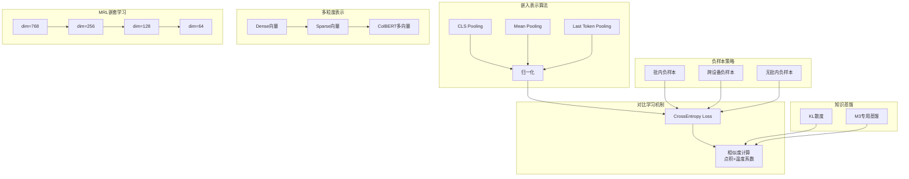
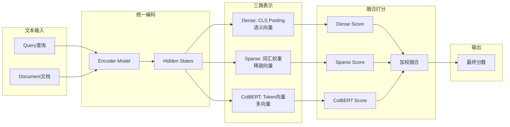

# FlagEmbedding 核心算法详解

## 模块架构总览



### 核心算法对比表

| 算法 | 类别 | 输入处理 | 输出形式 | 适用场景 | 优势 |
|------|------|---------|---------|---------|------|
| **CLS Pooling** | Pooling | last_hidden_state[:,0] | 向量 | 通用场景 | 简单高效 |
| **Mean Pooling** | Pooling | 加权平均 | 向量 | 长文本 | 信息完整 |
| **Last Token** | Pooling | 最后有效token | 向量 | Decoder模型 | 捕捉序列末尾 |
| **批内负样本** | 负采样 | batch内样本 | 矩阵 | 大batch训练 | 负样本充足 |
| **跨设备负样本** | 负采样 | 多GPU样本 | 矩阵 | 分布式训练 | 负样本更多 |
| **KL蒸馏** | 蒸馏 | teacher_scores | 概率分布 | 通用蒸馏 | 稳定可靠 |
| **M3蒸馏** | 蒸馏 | 多粒度分数 | 加权损失 | M3模型 | 精细化 |
| **Dense** | 表示 | pooling向量 | 稠密向量 | 语义匹配 | 语义理解强 |
| **Sparse** | 表示 | 词汇权重 | 稀疏向量 | 词汇匹配 | 精确匹配 |
| **ColBERT** | 表示 | token向量 | 多向量 | 细粒度匹配 | 局部语义 |

### BGE-M3 三表示融合流程



---

本文档详细分析 FlagEmbedding 框架中的核心算法实现,包括嵌入表示、对比学习、负样本策略、知识蒸馏、MRL、ColBERT 和稀疏检索等核心技术。

## 1. 嵌入表示算法

### 1.1 文本嵌入原理

文本嵌入是将自然语言文本转换为固定维度的稠密向量表示的过程。在 FlagEmbedding 中，主要基于 Transformer 架构的预训练语言模型（如 BERT、RoBERTa 等）来生成文本嵌入。

**核心流程：**
1. 输入文本通过 Tokenizer 转换为 token IDs
2. 将 token IDs 输入预训练语言模型
3. 获取模型的最后一层隐藏状态（last hidden state）
4. 通过 pooling 策略将序列级别的隐藏状态转换为句子级别的向量表示
5. 可选的归一化处理

### 1.2 Pooling 策略

FlagEmbedding 支持多种 pooling 策略，用于从 Transformer 输出的序列隐藏状态中提取固定长度的句子向量。

#### 1.2.1 CLS Pooling

CLS pooling 使用 <[BOS_never_used_51bce0c785ca2f68081bfa7d91973934]> token 的隐藏状态作为整个句子的表示。

**实现位置：**
- `/workspace/FlagEmbedding/finetune/embedder/encoder_only/base/modeling.py:94-95`
- `/workspace/FlagEmbedding/inference/embedder/encoder_only/base.py:301-302`

**代码实现：**
```python
if self.sentence_pooling_method == "cls":
    return last_hidden_state[:, 0]
```

**特点：**
- 简单直接，计算效率高
- 适合大多数场景
- 依赖 <[BOS_never_used_51bce0c785ca2f68081bfa7d91973934]> token 能够有效聚合全局信息

#### 1.2.2 Mean Pooling

Mean pooling 对所有有效 token 的隐藏状态取平均作为句子表示。

**实现位置：**
- `/workspace/FlagEmbedding/finetune/embedder/encoder_only/base/modeling.py:96-101`
- `/workspace/FlagEmbedding/inference/embedder/encoder_only/base.py:303-306`

**代码实现：**
```python
elif self.sentence_pooling_method == "mean":
    s = torch.sum(
        last_hidden_state * attention_mask.unsqueeze(-1).float(), dim=1
    )
    d = attention_mask.sum(dim=1, keepdim=True).float()
    return s / d
```

**特点：**
- 考虑了所有 token 的信息
- 对短文本和长文本都有较好表现
- 需要使用 attention mask 过滤 padding tokens

#### 1.2.3 Last Token Pooling

Last Token pooling 使用序列最后一个有效 token 的隐藏状态作为句子表示，主要用于 Decoder-Only 模型。

**实现位置：**
- `/workspace/FlagEmbedding/finetune/embedder/encoder_only/base/modeling.py:102-113`

**代码实现：**
```python
elif self.sentence_pooling_method == "last_token":
    left_padding = attention_mask[:, -1].sum() == attention_mask.shape[0]
    if left_padding:
        return last_hidden_state[:, -1]
    else:
        sequence_lengths = attention_mask.sum(dim=1) - 1
        batch_size = last_hidden_state.shape[0]
        return last_hidden_state[
            torch.arange(batch_size, device=last_hidden_state.device),
            sequence_lengths,
        ]
```

**特点：**
- 适合自回归模型
- 能够捕捉到序列末尾的信息
- 需要处理左填充和右填充的情况

### 1.3 归一化方法

归一化将嵌入向量转换为单位长度，便于使用余弦相似度进行计算。

**实现位置：**
- `/workspace/FlagEmbedding/finetune/embedder/encoder_only/base/modeling.py:104-105`
- `/workspace/FlagEmbedding/inference/embedder/encoder_only/base.py:263-264`

**代码实现：**
```python
if self.normalize_embeddings:
    all_p_reps = torch.nn.functional.normalize(all_p_reps, dim=-1)
```

**归一化的作用：**
- 使得余弦相似度与点积等价
- 简化相似度计算
- 提高训练稳定性

**推理时的嵌入截断：**
FlagEmbedding 还支持在推理时截断嵌入维度（用于 MRL）：

**实现位置：** `/workspace/FlagEmbedding/inference/embedder/encoder_only/base.py:262`

```python
embeddings = self._truncate_embeddings(embeddings)
```

---

## 2. 对比学习损失函数

### 2.1 对比学习原理

对比学习通过拉近正样本对的距离、推远负样本对的距离来学习有效的表示空间。在文本检索任务中，查询和其相关文档构成正样本对，查询和其他文档构成负样本对。

### 2.2 损失函数实现

FlagEmbedding 使用标准的交叉熵损失函数来计算对比学习损失。

**实现位置：**
- `/workspace/FlagEmbedding/finetune/embedder/encoder_only/base/modeling.py:56`
- `/workspace/FlagEmbedding/finetune/embedder/encoder_only/base/modeling.py:171-181`

**代码实现：**
```python
self.cross_entropy = torch.nn.CrossEntropyLoss(reduction='mean')

def compute_loss(self, scores, target):
    return self.cross_entropy(scores, target)
```

### 2.3 相似度计算

使用点积计算查询和文档向量之间的相似度，然后除以温度参数进行缩放。

**实现位置：**
- `/workspace/FlagEmbedding/finetune/embedder/encoder_only/base/modeling.py:143-169`

**代码实现：**
```python
def compute_score(self, q_reps, p_reps):
    scores = self._compute_similarity(q_reps, p_reps) / self.temperature
    scores = scores.view(q_reps.size(0), -1)
    return scores

def _compute_similarity(self, q_reps, p_reps):
    if len(p_reps.size()) == 2:
        return torch.matmul(q_reps, p_reps.transpose(0, 1))
    return torch.matmul(q_reps, p_reps.transpose(-2, -1))
```

**温度参数的作用：**
- 控制相似度得分的分布
- 影响模型的"置信度"
- 通常取值在 0.01 到 1.0 之间

---

## 3. 负样本策略

FlagEmbedding 支持三种负样本策略：无批内负样本、批内负样本、跨设备负样本。

### 3.1 批内负样本（In-batch Negatives）

批内负样本利用同一 batch 内的其他样本作为负样本，显著增加了负样本数量。

**实现位置：**
- `/workspace/FlagEmbedding/abc/finetune/embedder/AbsModeling.py:171-201`

**核心代码：**
```python
def _compute_in_batch_neg_loss(self, q_reps, p_reps, teacher_targets=None, compute_score_func=None, **kwargs):
    group_size = p_reps.size(0) // q_reps.size(0)

    if compute_score_func is None:
        scores = self.compute_score(q_reps, p_reps)
    else:
        scores = compute_score_func(q_reps, p_reps, **kwargs)

    if teacher_targets is not None:
        # 知识蒸馏相关逻辑
        ...
    else:
        idxs = torch.arange(q_reps.size(0), device=q_reps.device, dtype=torch.long)
        targets = idxs * group_size
        loss = self.compute_loss(scores, targets)

    return scores, loss
```

**工作原理：**
1. 对于 batch 中的每个查询，将同一 batch 中的所有文档都视为候选
2. 只有对应的正样本对的目标标签为非零
3. 其他所有样本都作为负样本

**优势：**
- 无需额外的负样本采样
- 计算效率高
- 负样本数量多，提高训练效果

### 3.2 跨设备负样本（Cross-device Negatives）

跨设备负样本在分布式训练环境中，利用所有设备上的样本作为负样本，进一步扩大负样本规模。

**实现位置：**
- `/workspace/FlagEmbedding/abc/finetune/embedder/AbsModeling.py:203-241`

**核心代码：**
```python
def _compute_cross_device_neg_loss(self, q_reps, p_reps, teacher_targets=None, compute_score_func=None, **kwargs):
    group_size = p_reps.size(0) // q_reps.size(0)

    cross_q_reps = self._dist_gather_tensor(q_reps)
    cross_p_reps = self._dist_gather_tensor(p_reps)

    if compute_score_func is None:
        cross_scores = self.compute_score(cross_q_reps, cross_p_reps)
    else:
        cross_scores = compute_score_func(cross_q_reps, cross_p_reps, **kwargs)

    # 计算损失
    ...

    return cross_scores, loss
```

**分布式张量收集：**
```python
def _dist_gather_tensor(self, t: Optional[torch.Tensor]):
    if t is None:
        return None
    t = t.contiguous()

    all_tensors = [torch.empty_like(t) for _ in range(self.world_size)]
    dist.all_gather(all_tensors, t)

    all_tensors[self.process_rank] = t
    all_tensors = torch.cat(all_tensors, dim=0)

    return all_tensors
```

**特点：**
- 充分利用分布式训练的优势
- 负样本数量 = 设备数 × batch_size
- 需要使用 PyTorch Distributed 进行通信

### 3.3 无批内负样本

当设置 `no_in_batch_neg_flag=True` 时，只使用数据中提供的负样本。

**实现位置：**
- `/workspace/FlagEmbedding/abc/finetune/embedder/AbsModeling.py:149-169`

**核心代码：**
```python
def _compute_no_in_batch_neg_loss(self, q_reps, p_reps, teacher_targets=None, compute_score_func=None, **kwargs):
    group_size = p_reps.size(0) // q_reps.size(0)

    local_scores = self.compute_local_score(q_reps, p_reps, compute_score_func, **kwargs)

    if teacher_targets is not None:
        loss = self.distill_loss(self.kd_loss_type, teacher_targets, local_scores, group_size=group_size)
        if self.kd_loss_type == "kl_div":
            local_targets = torch.zeros(local_scores.size(0), device=local_scores.device, dtype=torch.long)
            loss += self.compute_loss(local_scores, local_targets)
    else:
        local_targets = torch.zeros(local_scores.size(0), device=local_scores.device, dtype=torch.long)
        loss = self.compute_loss(local_scores, local_targets)

    return local_scores, loss
```

---

## 4. 知识蒸馏实现

知识蒸馏（Knowledge Distillation, KD）使用一个大的"教师"模型来指导小的"学生"模型的训练，提高学生模型的性能。

### 4.1 KL 散度损失

标准的知识蒸馏方法，使用 KL 散度来最小化教师模型和学生模型输出分布之间的差异。

**实现位置：**
- `/workspace/FlagEmbedding/abc/finetune/embedder/AbsModeling.py:319-324`

**代码实现：**
```python
if kd_loss_type == 'kl_div':
    return - torch.mean(
        torch.sum(torch.log_softmax(student_scores, dim=-1) * teacher_targets, dim=-1)
    )
```

**工作流程：**
1. 教师模型输出 teacher_scores
2. 使用 softmax 转换为概率分布 teacher_targets
3. 学生模型输出 student_scores
4. 计算 KL 散度损失
5. 可选：与标准交叉熵损失组合

**在训练中的应用：**
```python
if teacher_scores is not None:
    teacher_scores = torch.tensor(teacher_scores, device=device)
    teacher_scores = teacher_scores.view(batch_size, -1).detach()
    teacher_targets = F.softmax(teacher_scores, dim=-1)
else:
    teacher_targets = None
```

### 4.2 M3 KD 损失

专为 M3 模型设计的知识蒸馏损失函数。

**实现位置：**
- `/workspace/FlagEmbedding/abc/finetune/embedder/AbsModeling.py:325-340`

**代码实现：**
```python
elif kd_loss_type == 'm3_kd_loss':
    labels = torch.arange(student_scores.size(0), device=student_scores.device, dtype=torch.long)
    labels = labels * group_size

    loss = 0
    mask = torch.zeros_like(student_scores)
    for i in range(group_size):
        temp_target = labels + i
        temp_scores = student_scores + mask
        temp_loss = F.cross_entropy(temp_scores, temp_target, reduction="none")
        loss += torch.mean(teacher_targets[:, i] * temp_loss)
        mask = torch.scatter(mask, dim=-1, index=temp_target.unsqueeze(-1),
                            value=torch.finfo(student_scores.dtype).min)
    return loss
```

**特点：**
- 专门为多组负样本设计
- 逐个处理每个负样本位置
- 使用 mask 避免重复计算

---

## 5. MRL（Matryoshka Representation Learning）原理

Matryoshka Representation Learning 学习一系列嵌套的表示，使得低维嵌入是高维嵌入的前缀，可以灵活地在推理时选择不同的维度。

### 5.1 原理

MRL 的核心思想是训练一个可以产生多种维度嵌入的单一模型。在训练时，同时优化多个维度的嵌入，使得每个低维嵌入都是对应高维嵌入的前 k 维。

### 5.2 代码实现

**实现位置：**
- `/workspace/FlagEmbedding/finetune/embedder/encoder_only/base/modeling.py:91-102`
- `/workspace/FlagEmbedding/abc/finetune/embedder/AbsModeling.py:264-295`

**编码时的 MRL 处理：**
```python
def encode(self, features):
    # ... 基础编码逻辑 ...
    if self.use_mrl:
        p_reps_list = []
        ori_dim = all_p_reps.size(-1)
        for dim in self.mrl_dims:
            if dim > ori_dim:
                logger.warning(f"MRL dim {dim} is larger than original dimension {ori_dim}, using original dimension instead")
            dim = min(dim, ori_dim)
            dim_p_reps = all_p_reps[:, :dim]
            if self.normalize_embeddings:
                dim_p_reps = torch.nn.functional.normalize(dim_p_reps, dim=-1)
            p_reps_list.append(dim_p_reps.contiguous())
        return p_reps_list
    else:
        if self.normalize_embeddings:
            all_p_reps = torch.nn.functional.normalize(all_p_reps, dim=-1)
        return all_p_reps.contiguous()
```

**训练时的 MRL 损失计算：**
```python
if self.use_mrl:
    all_loss = torch.tensor(0.0, device=device)
    for dim_q_reps, dim_p_reps in zip(q_reps, p_reps):
        _, mrl_loss = compute_loss_func(dim_q_reps, dim_p_reps, teacher_targets=teacher_targets)
        all_loss += mrl_loss
    loss = all_loss / len(self.mrl_dims)
else:
    scores, loss = compute_loss_func(q_reps, p_reps, teacher_targets=teacher_targets)
```

**MRL 的优势：**
- 一次训练，多次使用
- 可以在推理时根据需要选择维度
- 低维嵌入保持较好的性能
- 节省存储和计算资源

---

## 6. ColBERT 与稀疏检索（M3 模型）

BGE-M3 是 FlagEmbedding 的核心研究成果，它同时支持稠密检索、稀疏检索和 ColBERT 三种检索方式。

### 6.1 整体架构

M3 模型在基础 encoder 之上增加了两个线性层：
- `sparse_linear`: 用于生成稀疏表示
- `colbert_linear`: 用于生成 ColBERT 多向量表示

**实现位置：**
- `/workspace/FlagEmbedding/finetune/embedder/encoder_only/m3/modeling.py:70-72`

**初始化：**
```python
if not self.unified_finetuning:
    self.model = base_model['model']
    self.colbert_linear = None
    self.sparse_linear = None
else:
    self.model = base_model['model']
    self.colbert_linear = base_model['colbert_linear']
    self.sparse_linear = base_model['sparse_linear']
```

### 6.2 稠密表示（Dense）

与基础模型相同，使用 pooling 策略生成句子级稠密向量。

**实现位置：**
- `/workspace/FlagEmbedding/finetune/embedder/encoder_only/m3/modeling.py:81-113`

```python
def _dense_embedding(self, last_hidden_state, attention_mask):
    if self.sentence_pooling_method == "cls":
        return last_hidden_state[:, 0]
    elif self.sentence_pooling_method == "mean":
        s = torch.sum(
            last_hidden_state * attention_mask.unsqueeze(-1).float(), dim=1
        )
        d = attention_mask.sum(dim=1, keepdim=True).float()
        return s / d
    # ...
```

### 6.3 稀疏表示（Sparse）

稀疏表示将文本表示为词袋形式的高维稀疏向量，每个维度对应词汇表中的一个 token。

**实现位置：**
- `/workspace/FlagEmbedding/finetune/embedder/encoder_only/m3/modeling.py:116-157`

**核心代码：**
```python
def _sparse_embedding(self, hidden_state, input_ids, return_embedding: bool = True):
    token_weights = torch.relu(self.sparse_linear(hidden_state))
    if not return_embedding:
        return token_weights

    if self.training:
        sparse_embedding = torch.zeros(
            input_ids.size(0), input_ids.size(1), self.vocab_size,
            dtype=token_weights.dtype,
            device=token_weights.device
        )
        sparse_embedding = torch.scatter(sparse_embedding, dim=-1, index=input_ids.unsqueeze(-1), src=token_weights)
        sparse_embedding = torch.max(sparse_embedding, dim=1).values
    else:
        sparse_embedding = torch.zeros(
            input_ids.size(0), self.vocab_size,
            dtype=token_weights.dtype,
            device=token_weights.device
        )
        sparse_embedding = sparse_embedding.scatter_reduce(
            dim=-1, index=input_ids, src=token_weights.squeeze(-1), reduce="amax"
        )

    unused_tokens = [
        self.tokenizer.cls_token_id, self.tokenizer.eos_token_id,
        self.tokenizer.pad_token_id, self.tokenizer.unk_token_id
    ]
    sparse_embedding[:, unused_tokens] *= 0.
    return sparse_embedding
```

**稀疏检索优势：**
- 精确的词汇匹配
- 可解释性强
- 适合专门术语和专有名词
- 可以与 BM25 等传统检索方法结合

**推理时的处理：**
在推理时，稀疏权重会被处理成 token 级别的权重字典：

```python
def _process_token_weights(token_weights: np.ndarray, input_ids: list):
    result = defaultdict(int)
    unused_tokens = set()
    for _token in ['cls_token', 'eos_token', 'pad_token', 'unk_token']:
        if _token in self.tokenizer.special_tokens_map:
            _token_id = self.tokenizer.convert_tokens_to_ids(self.tokenizer.special_tokens_map[_token])
            unused_tokens.add(_token_id)
    for w, idx in zip(token_weights, input_ids):
        if idx not in unused_tokens and w > 0:
            idx = str(idx)
            if w > result[idx]:
                result[idx] = w
    return result
```

### 6.4 ColBERT 多向量表示

ColBERT 为每个 token（除了 <[BOS_never_used_51bce0c785ca2f68081bfa7d91973934]>）生成一个向量表示，使用 token 级别的最大相似度进行匹配。

**实现位置：**
- `/workspace/FlagEmbedding/finetune/embedder/encoder_only/m3/modeling.py:159-171`

**核心代码：**
```python
def _colbert_embedding(self, last_hidden_state, mask):
    colbert_vecs = self.colbert_linear(last_hidden_state[:, 1:])
    colbert_vecs = colbert_vecs * mask[:, 1:][:, :, None].float()
    return colbert_vecs
```

**ColBERT 分数计算：**
```python
def compute_colbert_score(self, q_reps, p_reps, q_mask: torch.Tensor = None):
    token_scores = torch.einsum('qin,pjn->qipj', q_reps, p_reps)
    scores, _ = token_scores.max(-1)
    scores = scores.sum(1) / q_mask[:, 1:].sum(-1, keepdim=True)
    scores = scores / self.temperature
    return scores
```

**ColBERT 优势：**
- 细粒度的 token 级别匹配
- 更好的局部语义匹配能力
- 适合复杂查询和长文档

### 6.5 统一训练策略

M3 模型采用统一微调策略，同时优化三种表示方式。

**实现位置：**
- `/workspace/FlagEmbedding/finetune/embedder/encoder_only/m3/modeling.py:374-476`

**核心训练逻辑：**
```python
def forward(self, queries, passages, teacher_scores=None, no_in_batch_neg_flag=False):
    q_dense_vecs, q_sparse_vecs, q_colbert_vecs = self.encode(queries)
    p_dense_vecs, p_sparse_vecs, p_colbert_vecs = self.encode(passages)

    if self.training:
        # 计算稠密损失
        dense_scores, loss = compute_loss_func(
            q_dense_vecs, p_dense_vecs, teacher_targets=teacher_targets,
            compute_score_func=self.compute_dense_score
        )

        if self.unified_finetuning:
            # 计算稀疏损失
            sparse_scores, sparse_loss = compute_loss_func(
                q_sparse_vecs, p_sparse_vecs, teacher_targets=teacher_targets,
                compute_score_func=self.compute_sparse_score
            )

            # 计算 ColBERT 损失
            colbert_scores, colbert_loss = compute_loss_func(
                q_colbert_vecs, p_colbert_vecs, teacher_targets=teacher_targets,
                compute_score_func=self.compute_colbert_score,
                q_mask=self._get_queries_attention_mask(queries)
            )

            # 集成损失
            ensemble_scores, ensemble_loss = compute_loss_func(
                q_dense_vecs, p_dense_vecs, teacher_targets=teacher_targets,
                compute_score_func=self.ensemble_score,
                dense_scores=dense_scores,
                sparse_scores=sparse_scores,
                colbert_scores=colbert_scores
            )

            loss = (loss + ensemble_loss + 0.1 * sparse_loss + colbert_loss) / 4

            # 自蒸馏
            if self.use_self_distill and self.step > self.self_distill_start_step:
                self_teacher_targets = torch.softmax(ensemble_scores.detach(), dim=-1)
                # ... 自蒸馏损失计算 ...

    return EmbedderOutput(loss=loss)
```

### 6.6 集成打分

M3 支持三种方式的集成打分，获得更好的检索效果。

**实现位置：**
- `/workspace/FlagEmbedding/finetune/embedder/encoder_only/m3/modeling.py:173-189`
- `/workspace/FlagEmbedding/finetune/embedder/encoder_only/m3/modeling.py:239-257`

**代码实现：**
```python
def compute_score(self, q_reps, p_reps, q_mask, dense_weight=1.0, sparse_weight=0.3, colbert_weight=1.0):
    dense_score = self.compute_dense_score(q_reps, p_reps)
    sparse_score = self.compute_sparse_score(q_reps, p_reps)
    colbert_score = self.compute_colbert_score(q_reps, p_reps, q_mask=q_mask)
    return dense_score * dense_weight + sparse_score * sparse_weight + colbert_score * colbert_weight

def ensemble_score(self, q_reps, p_reps, dense_scores=None, sparse_scores=None, colbert_scores=None):
    if dense_scores is None or sparse_scores is None or colbert_scores is None:
        raise ValueError("dense_scores, sparse_scores, colbert_scores must be provided!")
    return dense_scores + 0.3 * sparse_scores + colbert_scores
```

**推理时的打分：**
```python
def compute_score_single_device(self, sentence_pairs, ...):
    # ...
    dense_scores = self.model.compute_dense_score(q_dense_vecs, p_dense_vecs)
    sparse_scores = self.model.compute_sparse_score(q_sparse_vecs, p_sparse_vecs)
    colbert_scores = self.model.compute_colbert_score(
        q_colbert_vecs, p_colbert_vecs,
        q_mask=queries_inputs['attention_mask']
    )
    # ... 集成计算 ...
```

---

## 7. 总结

FlagEmbedding 提供了丰富的核心算法实现，包括：

| 算法模块 | 核心功能 | 关键特点 |
|---------|---------|---------|
| **嵌入表示** | 文本到向量的转换 | 支持多种 pooling 策略 |
| **对比学习** | 训练有效的表示空间 | 基于交叉熵损失 |
| **负样本策略** | 提供多样化的负样本 | 批内/跨设备负样本 |
| **知识蒸馏** | 大模型指导小模型 | KL 散度和 M3 KD |
| **MRL** | 灵活的维度选择 | 嵌套表示学习 |
| **ColBERT & 稀疏** | 多粒度检索 | M3 统一架构 |

这些核心算法共同构成了 FlagEmbedding 强大的表示学习和检索能力，使得它在众多文本检索任务上取得了优异的性能。
