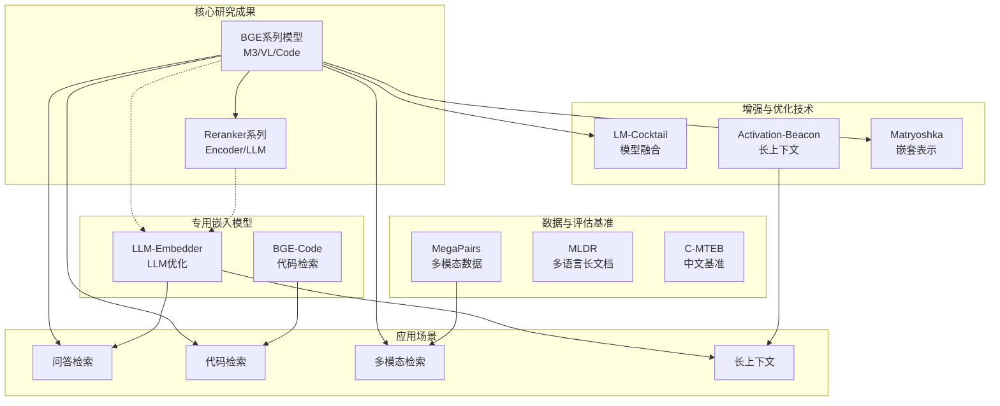
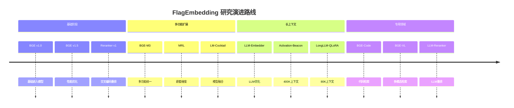

# FlagEmbedding 研究项目分析

## 模块架构总览



### 核心研究项目对比表

| 项目 | 类别 | 核心创新 | 适用场景 | 性能亮点 |
|------|------|---------|---------|---------|
| **BGE-M3** | 核心模型 | 多功能+多语言+多粒度 | 通用检索 | SOTA 性能 |
| **LM-Cocktail** | 模型融合 | 加权参数融合 | 灾难性遗忘 | 零样本适应 |
| **LLM-Embedder** | 专用嵌入 | 6种检索场景统一 | LLM增强 | 多场景覆盖 |
| **Activation-Beacon** | 长上下文 | 激活压缩 | 400K上下文 | 高效低内存 |
| **BGE-VL** | 多模态 | MegaPairs数据 | 图像-文本 | 通用多模态 |
| **BGE-Code** | 代码检索 | 代码专用 | 代码检索 | CoIR SOTA |

### 技术演进路线图



---

## 目录

1. [BGE-M3：重点分析](#bge-m3重点分析)
2. [LM-Cocktail：模型融合技术](#lm-cocktail模型融合技术)
3. [LLM-Embedder：为 LLM 设计的嵌入模型](#llm-embedder为-llm-设计的嵌入模型)
4. [Activation-Beacon：长上下文扩展技术](#activation-beacon长上下文扩展技术)
5. [BGE-VL：多模态检索模型](#bge-vl多模态检索模型)
6. [BGE-Code：代码嵌入模型](#bge-code代码嵌入模型)
7. [其他研究项目](#其他研究项目)

---

## BGE-M3：重点分析

### 项目概述

BGE-M3 是 FlagEmbedding 项目中的旗舰研究成果，其名称中的 "M3" 代表了三个核心特性：**Multi-Functionality（多功能）**、**Multi-Linguality（多语言）**、**Multi-Granularity（多粒度）**。

- **论文**：[BGE M3-Embedding: Multi-Lingual, Multi-Functionality, Multi-Granularity Text Embeddings Through Self-Knowledge Distillation](https://arxiv.org/pdf/2402.03216.pdf)
- **代码位置**：
  - 推理实现：`/workspace/FlagEmbedding/inference/embedder/encoder_only/m3.py`
  - 微调实现：`/workspace/FlagEmbedding/finetune/embedder/encoder_only/m3/`
  - 研究代码：`/workspace/research/BGE_M3/`

### 核心特性详解

#### 1. 多功能性（Multi-Functionality）

BGE-M3 能够同时支持三种不同的检索模式，这是其最突出的创新点：

##### （1）密集检索（Dense Retrieval）

将文本映射为单个稠密向量，是最常用的嵌入检索方式。

**实现代码**（`/workspace/research/BGE_M3/modeling.py`）：

```python
def dense_embedding(self, hidden_state, mask):
    if self.sentence_pooling_method == 'cls':
        return hidden_state[:, 0]
    elif self.sentence_pooling_method == 'mean':
        s = torch.sum(hidden_state * mask.unsqueeze(-1).float(), dim=1)
        d = mask.sum(axis=1, keepdim=True).float()
        return s / d
```

**推理实现**（`/workspace/FlagEmbedding/inference/embedder/encoder_only/m3.py`）：
- 支持 `cls` 和 `mean` 两种池化方式
- 可选择是否对向量进行归一化

##### （2）稀疏检索（Sparse Retrieval / Lexical Matching）

提供类似 BM25 的词汇匹配能力，每个 token 都有对应的权重值。

**实现代码**（`/workspace/research/BGE_M3/modeling.py`）：

```python
def sparse_embedding(self, hidden_state, input_ids, return_embedding: bool = True):
    token_weights = torch.relu(self.sparse_linear(hidden_state))
    if not return_embedding: return token_weights

    if self.training:
        sparse_embedding = torch.zeros(
            input_ids.size(0), input_ids.size(1), self.vocab_size,
            dtype=token_weights.dtype,
            device=token_weights.device
        )
        sparse_embedding = torch.scatter(sparse_embedding, dim=-1, index=input_ids.unsqueeze(-1), src=token_weights)
        sparse_embedding = torch.max(sparse_embedding, dim=1).values
    else:
        # 优化版本：使用 scatter_reduce
        sparse_embedding = torch.zeros(
            input_ids.size(0), self.vocab_size,
            dtype=token_weights.dtype,
            device=token_weights.device
        )
        sparse_embedding = sparse_embedding.scatter_reduce(
            dim=-1, index=input_ids, src=token_weights.squeeze(-1), reduce="amax"
        )

    unused_tokens = [self.tokenizer.cls_token_id, self.tokenizer.eos_token_id, 
                     self.tokenizer.pad_token_id, self.tokenizer.unk_token_id]
    sparse_embedding[:, unused_tokens] *= 0.
    return sparse_embedding
```

**关键实现细节**：
- 使用 `sparse_linear` 层将隐藏状态映射为 token 权重
- 通过 ReLU 确保权重非负
- 特殊 token（CLS、EOS、PAD、UNK）权重设为 0
- 推理时使用 `scatter_reduce` 优化性能

##### （3）多向量检索（Multi-Vector Retrieval / ColBERT）

为每个 token 生成一个向量，支持更细粒度的语义匹配。

**实现代码**（`/workspace/research/BGE_M3/modeling.py`）：

```python
def colbert_embedding(self, last_hidden_state, mask):
    colbert_vecs = self.colbert_linear(last_hidden_state[:, 1:])  # 跳过 <[BOS_never_used_51bce0c785ca2f68081bfa7d91973934]> token
    colbert_vecs = colbert_vecs * mask[:, 1:][:, :, None].float()
    return colbert_vecs
```

**得分计算**（`/workspace/research/BGE_M3/modeling.py`）：

```python
def colbert_score(self, q_reps, p_reps, q_mask: torch.Tensor):
    token_scores = torch.einsum('qin,pjn->qipj', q_reps, p_reps)
    scores, _ = token_scores.max(-1)  # 对每个查询 token 取最大匹配
    scores = scores.sum(1) / q_mask[:, 1:].sum(-1, keepdim=True)  # 平均
    scores = scores / self.temperature
    return scores
```

#### 2. 多语言支持（Multi-Linguality）

BGE-M3 支持超过 100 种语言，基于 XLM-RoBERTa 架构扩展而来：

- 基础模型：XLM-RoBERTa-large
- 词汇表大小：250,000+
- 预训练数据覆盖多语言语料

#### 3. 多粒度支持（Multi-Granularity）

支持处理从短句子到长达 8192 tokens 的长文档：

**高效批处理策略**（`/workspace/research/BGE_M3/modeling.py`）：

```python
def compute_sub_batch_size(self, features):
    mapping = [(6000, 1), (5000, 2), (4000, 3), (3000, 3), (2000, 5), (1000, 9), (512, 16), (0, 32)]
    cur_l = features['input_ids'].size(-1)
    for l, b in mapping:
        if cur_l >= l:
            return b
```

根据输入序列长度动态调整子批次大小，有效解决长文本训练的内存问题。

### 统一微调架构

BGE-M3 采用创新的统一微调框架，同时优化三种检索模式：

**模型结构**（`/workspace/research/BGE_M3/modeling.py`）：

```python
def load_model(self, model_name, colbert_dim: int = -1):
    self.model = AutoModel.from_pretrained(model_name)
    self.tokenizer = AutoTokenizer.from_pretrained(model_name)

    # 两个额外的线性层
    self.colbert_linear = torch.nn.Linear(in_features=self.model.config.hidden_size,
                                          out_features=self.model.config.hidden_size if colbert_dim == -1 else colbert_dim)
    self.sparse_linear = torch.nn.Linear(in_features=self.model.config.hidden_size, out_features=1)
```

**损失函数设计**（`/workspace/research/BGE_M3/modeling.py`）：

```python
if self.unified_finetuning:
    # 分别计算三种模式的损失
    sparse_scores = self.sparse_score(q_sparse_vecs, p_sparse_vecs)
    sparse_loss = self.compute_loss(sparse_scores, targets)

    colbert_scores = self.colbert_score(q_colbert_vecs, p_colbert_vecs, q_mask=query['attention_mask'])
    colbert_loss = self.compute_loss(colbert_scores, targets)

    # 集成得分损失
    ensemble_loss = self.compute_loss(dense_scores + 0.3 * sparse_scores + colbert_scores, targets)
    
    # 加权组合所有损失
    loss = (loss + ensemble_loss + 0.1 * sparse_loss + colbert_loss) / 4
```

### 自知识蒸馏（Self-Knowledge Distillation）

BGE-M3 的核心创新技术之一，利用多模式的集成输出作为教师信号来增强单模式的性能：

**实现代码**（`/workspace/research/BGE_M3/modeling.py`）：

```python
if self.use_self_distill and self.step > self.self_distill_start_step and self.unified_finetuning:
    ensemble_scores = dense_scores + 0.3 * sparse_scores + colbert_scores
    teacher_targets = torch.softmax(ensemble_scores.detach(), dim=-1)
    
    ensemble_distill_dense_loss = - torch.mean(
        torch.sum(torch.log_softmax(dense_scores, dim=-1) * teacher_targets, dim=-1))
    ensemble_distill_sparse_loss = - torch.mean(
        torch.sum(torch.log_softmax(sparse_scores, dim=-1) * teacher_targets, dim=-1))
    ensemble_distill_colbert_loss = - torch.mean(
        torch.sum(torch.log_softmax(colbert_scores, dim=-1) * teacher_targets, dim=-1))
    
    loss += (ensemble_distill_dense_loss + 0.1 * ensemble_distill_sparse_loss + ensemble_distill_colbert_loss) / 3
    loss = loss / 2
```

### 推理实现分析

**M3Embedder 类**（`/workspace/FlagEmbedding/inference/embedder/encoder_only/m3.py`）：

核心功能：
1. 支持返回多种类型的嵌入
2. 提供词汇匹配得分计算
3. 提供 ColBERT 得分计算
4. 支持混合模式的综合得分计算

**关键方法**：

```python
def encode_single_device(self, sentences, batch_size=256, max_length=8192,
                         return_dense=True, return_sparse=False, return_colbert_vecs=False):
    # ...
    # 支持按长度排序优化 padding 效率
    length_sorted_idx = np.argsort([-len(x['input_ids']) for x in all_inputs])
    # ...
    # 动态调整 batch size 处理 OOM
    while flag is False:
        try:
            # ...
        except RuntimeError as e:
            batch_size = batch_size * 3 // 4
```

**混合得分计算**：

```python
def compute_score_single_device(self, sentence_pairs, batch_size=256, 
                                max_query_length=512, max_passage_length=512,
                                weights_for_different_modes=None):
    # ...
    # 支持自定义权重混合三种模式得分
    if weights_for_different_modes is None:
        weights_for_different_modes = [1., 1., 1.]
        weight_sum = 3
    # ...
    all_scores['sparse+dense'] = (sparse_scores * w[1] + dense_scores * w[0]) / (w[1] + w[0])
    all_scores['colbert+sparse+dense'] = (colbert_scores * w[2] + sparse_scores * w[1] + dense_scores * w[0]) / weight_sum
```

---

## LM-Cocktail：模型融合技术

### 项目概述

LM-Cocktail 是一种通过模型融合来提升性能的技术，主要解决两个问题：
1. 微调后的模型在目标任务上表现好，但在通用任务上性能下降（灾难性遗忘）
2. 无需额外训练，通过融合已有模型来适应新任务

- **论文**：[LM-Cocktail: Resilient Tuning of Language Models via Model Merging](https://arxiv.org/abs/2311.13534)
- **代码位置**：`/workspace/research/LM_Cocktail/`

### 核心思想

通过加权融合多个模型的参数，获得兼具通用性和专业性的模型：

```
Merged = w1 * M1 + w2 * M2 + ... + wn * Mn
```

### 关键功能

#### 1. 基础模型融合

**实现代码**（`/workspace/research/LM_Cocktail/LM_Cocktail/cocktail.py`）：

```python
def mix_models(model_names_or_paths: List[str], 
               model_type: str, 
               weights: List[float], 
               output_path: str=None):
    """
    mix models based on given weights
    """
    assert len(model_names_or_paths) == len(weights)
    assert model_type in ['decoder', 'encoder', 'reranker']
    assert sum(weights) - 1 <= 1e-3
    
    # 获取所有模型的参数
    param_list = get_model_param_list(model_names_or_paths, model_type=model_type)
    # 融合参数
    new_param = merge_param(param_list, weights=weights)
    
    # 加载第一个模型的架构，然后加载融合后的参数
    model = load_model(model_names_or_paths[0], model_type=model_type)
    model.load_state_dict(new_param)
    
    # 保存模型
    if output_path is not None:
        model.save_pretrained(output_path)
        tokenizer = AutoTokenizer.from_pretrained(model_names_or_paths[0], trust_remote_code=True)
        tokenizer.save_pretrained(output_path)
    return model
```

#### 2. 基于数据自动计算权重

无需手动指定权重，通过少量示例数据自动计算各模型的重要性：

**实现代码**（`/workspace/research/LM_Cocktail/LM_Cocktail/cocktail.py`）：

```python
def mix_models_with_data(model_names_or_paths: List[str], 
                         model_type: str, 
                         example_data: List[Dict], 
                         temperature: float=5.0,
                         batch_size:int=2, 
                         max_input_length:int=2048, 
                         neg_number: int=7,
                         output_path: str=None):
    """
    mix model based on given a few examples
    """
    # 1. 计算每个模型在示例数据上的权重
    weights = compute_weights(model, tokenizer=tokenizer, param_list=param_list, 
                              model_type=model_type, example_data=example_data, 
                              temperature=temperature, neg_number=neg_number,
                              batch_size=batch_size, max_input_length=max_input_length)
    
    # 2. 根据计算出的权重融合模型
    new_param = merge_param(param_list, weights=weights)    
    model.load_state_dict(new_param)
    
    return model
```

#### 3. 逐层融合（降低内存消耗）

对于大模型，支持逐层加载和融合，避免同时加载多个完整模型：

**实现代码**（`/workspace/research/LM_Cocktail/LM_Cocktail/cocktail.py`）：

```python
def mix_models_by_layers(model_names_or_paths: List[str], 
                         model_type: str, 
                         weights: List[float], 
                         output_path: str=None):
    """
    mix models based on given weights, and load them layer by layer
    """
    # 逐层获取参数并融合，减少内存占用
    param_dirs, temp_dir = get_model_param_dirs(model_names_or_paths, model_type=model_type)
    temp_file_path = merge_param_by_layer(param_dirs, weights=weights)
    
    # 使用 accelerate 加载融合后的模型
    with init_empty_weights():
        meta_model = AutoModelForCausalLM.from_pretrained(...)  # 或其他模型类型
    
    device_map = {name: "cpu" for name, _ in meta_model.named_modules()}
    model = load_checkpoint_and_dispatch(meta_model, checkpoint=temp_file_path, device_map=device_map)
    
    # 清理临时文件
    os.remove(temp_file_path)
    shutil.rmtree(temp_dir)
    
    return model
```

### 应用场景

1. **缓解灾难性遗忘**：融合微调模型与基础模型
2. **零样本适应新任务**：融合多个在不同任务上微调的模型
3. **近似多任务学习**：融合多个单任务模型获得多任务能力

### 性能优势

- 目标任务性能保持，其他任务性能恢复
- 无需额外训练数据和计算资源
- 适用于编码器、解码器、重排序器等多种模型类型

---

## LLM-Embedder：为 LLM 设计的嵌入模型

### 项目概述

LLM-Embedder 是专门为增强大语言模型能力而设计的统一嵌入模型，支持多种检索增强场景。

- **论文**：[Retrieve Anything To Augment Large Language Models](https://arxiv.org/pdf/2310.07554.pdf)
- **代码位置**：`/workspace/research/llm_embedder/`

### 支持的检索场景

LLM-Embedder 在 6 种不同的检索任务上进行了微调：

| 任务 | 描述 |
|------|------|
| QA (问答) | 检索相关文档回答问题 |
| Conversational Search (对话搜索) | 在多轮对话中检索信息 |
| Long Conversation (长对话) | 检索历史对话记忆 |
| Long-Range Language Modeling (长程语言建模) | 检索长文档中的相关上下文 |
| In-Context Learning (上下文学习) | 检索有用的示例 |
| Tool Learning (工具学习) | 检索相关工具描述 |

### 指令模板设计

每个任务都有专门的指令模板：

```python
INSTRUCTIONS = {
    "qa": {
        "query": "Represent this query for retrieving relevant documents: ",
        "key": "Represent this document for retrieval: ",
    },
    "icl": {
        "query": "Convert this example into vector to look for useful examples: ",
        "key": "Convert this example into vector for retrieval: ",
    },
    # ... 其他任务
}
```

### 评估框架

项目提供了完整的评估框架来测试不同检索方法在各个场景下的效果：

- 评估代码位置：`/workspace/research/llm_embedder/evaluation/`
- 支持检索方法：BM25、密集检索、重排序等

---

## Activation-Beacon：长上下文扩展技术

### 项目概述

Activation-Beacon 是一种高效扩展大语言模型上下文窗口的技术，无需重新训练完整模型。

- **论文**：[Soaring from 4K to 400K: Extending LLM's Context with Activation Beacon](https://arxiv.org/abs/2401.03462)
- **代码位置**：`/workspace/research/Long_LLM/activation_beacon/`

### 核心思想

通过压缩 LLM 的原始激活值为更紧凑的表示（Beacon），使模型能够感知更长的上下文：

1. 在常规上下文窗口内处理文本
2. 定期生成 Beacon 来压缩历史信息
3. 利用 Beacon 让模型"记住"更长的历史

### 技术特点

- **有效**：在多个长上下文任务上表现优异
- **高效**：推理速度快，内存占用低
- **兼容**：适用于多种 LLM 架构（Llama、Mistral、Qwen 等）
- **低成本训练**：仅需少量参数调整

### 支持的模型

- Mistral
- Llama-3
- Qwen-2
- 等多种主流大语言模型

### 使用示例

```python
from transformers import AutoModelForCausalLM, AutoTokenizer

model_id = "namespace-Pt/beacon-qwen-2-7b-instruct"
tokenizer = AutoTokenizer.from_pretrained(model_id, trust_remote_code=True)
model = AutoModelForCausalLM.from_pretrained(model_id, trust_remote_code=True)

# 重置记忆
model.memory.reset()

# 处理长上下文
messages = [{"role": "user", "content": very_long_text}]
inputs = tokenizer.apply_chat_template(messages, return_tensors="pt")
outputs = model.generate(**inputs)
```

---

## BGE-VL：多模态检索模型

### 项目概述

BGE-VL 是 BGE 系列的多模态扩展，支持图像和文本的联合检索。

- **论文**：[MegaPairs: Massive Data Synthesis For Universal Multimodal Retrieval](https://arxiv.org/abs/2412.14475)
- **代码位置**：`/workspace/research/BGE_VL/`

### 模型系列

| 模型 | 架构 | 特点 |
|------|------|------|
| BGE-VL-base | CLIP 基础 | 轻量级多模态嵌入 |
| BGE-VL-large | CLIP 大模型 | 更强的多模态能力 |
| BGE-VL-MLLM-S1 | LLaVA-NeXT | 在 MegaPairs 上训练，组合图像检索 SOTA |
| BGE-VL-MLLM-S2 | LLaVA-NeXT | S1 + MMEB 微调，通用多模态嵌入 |

### MegaPairs 数据集

项目贡献了 MegaPairs，一个包含超过 2600 万多模态检索三元组的大规模数据集：

- 数据类型：异构 KNN 三元组（查询图像 + 文本指令 → 目标图像）
- 来源：基于开放域图像合成
- 用途：通用多模态检索训练

### 支持的检索任务

1. **文本到图像**：用文本查询检索图像
2. **图像到图像**：用图像查询检索相似图像
3. **组合检索**：图像 + 文本指令 → 目标图像
4. **跨模态通用检索**：支持多种多模态混合场景

---

## BGE-Code：代码嵌入模型

### 项目概述

BGE-Code（CodeR）是专门为代码检索设计的嵌入模型，支持多种编程语言和自然语言查询。

- **模型**：[BAAI/bge-code-v1](https://huggingface.co/BAAI/bge-code-v1)
- **代码位置**：`/workspace/research/BGE_Coder/`

### 核心特性

1. **代码检索性能优越**：在多个代码检索基准上达到 SOTA
2. **保持文本检索能力**：同时支持通用文本检索
3. **多语言支持**：支持 20+ 编程语言，自然语言支持中英等多语言
4. **长上下文**：支持 4096 tokens，适合处理长代码片段

### 支持的检索场景

| 场景 | 描述 |
|------|------|
| 代码竞赛 | 根据问题描述检索解决方案 |
| 文本到代码 | 用自然语言查询检索代码 |
| 代码到文档 | 检索代码对应的文档 |
| 代码到代码 | 检索语义相似的代码 |
| 多轮对话代码 | 在对话中检索相关代码 |

### 评估基准

在 CoIR（Code Retrieval Benchmark）和 CodeRAG 基准上进行了全面评估，结果表明 BGE-Code 显著优于其他代码嵌入模型。

---

## 其他研究项目

### 1. BGE-Reranker & LLM-Reranker

跨编码器重排序模型，提供比双编码器更高的检索精度：

- **代码位置**：
  - `FlagEmbedding/inference/reranker/`
  - `research/llm_reranker/`
- **特点**：支持多种语言、长文本、基于 LLM 的重排序

### 2. C-MTEB & MLDR

中文和多语言嵌入评估基准：

- **C-MTEB**：中文文本嵌入基准（已合并到 MTEB）
- **MLDR**：多语言长文档检索数据集，覆盖 13 种语言
- **位置**：`/workspace/research/C_MTEB/`

### 3. LongLLM-QLoRA

通过 QLoRA 高效扩展 Llama-3 上下文长度至 80K：

- **位置**：`/workspace/research/Long_LLM/longllm_qlora/`
- **特点**：训练高效，保持原始模型在短上下文上的能力

### 4. Visualized-BGE

将图像 token 嵌入集成到 BGE 文本嵌入框架中：

- 支持混合模态检索
- 可作为下游多模态任务的基础模型

### 5. Matryoshka-Reranker

基于 Matryoshka 表示学习的重排序器，支持灵活的维度选择。

### 6. LLARA

LLM 增强的检索架构，结合了大语言模型和检索系统的优势。

### 7. Reinforced-IR

基于强化学习的检索优化方法，通过反馈持续改进检索质量。

---

## 总结

FlagEmbedding 的研究项目形成了一个完整的生态系统：

1. **核心嵌入模型**：BGE 系列（v1.5、M3、Code、VL）
2. **增强技术**：LM-Cocktail（模型融合）、Activation-Beacon（长上下文）
3. **专用模型**：LLM-Embedder（为 LLM 优化）、Reranker（重排序）
4. **数据与基准**：MegaPairs、MLDR、C-MTEB

这些项目共同推动了嵌入技术在不同场景下的应用，从通用文本到代码、图像、长文档等多个领域都有相应的解决方案。
