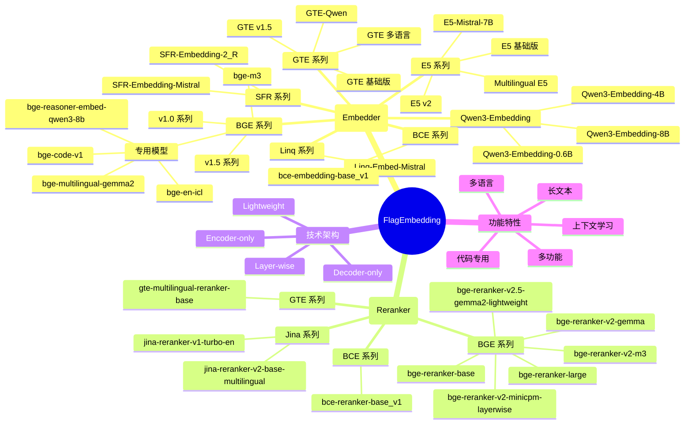
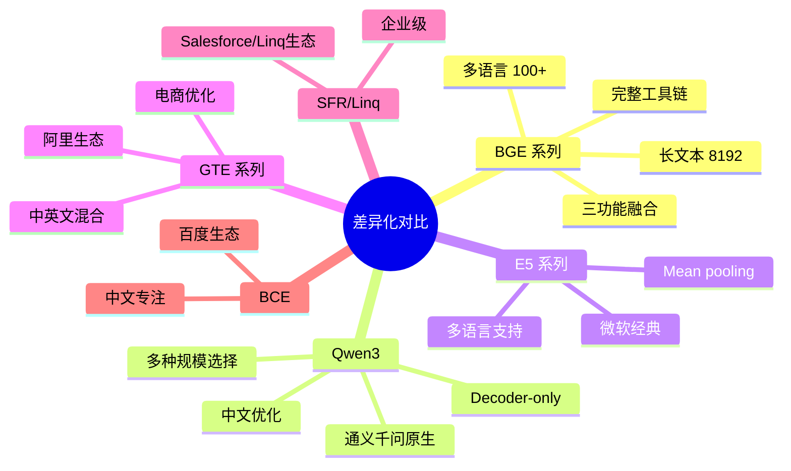
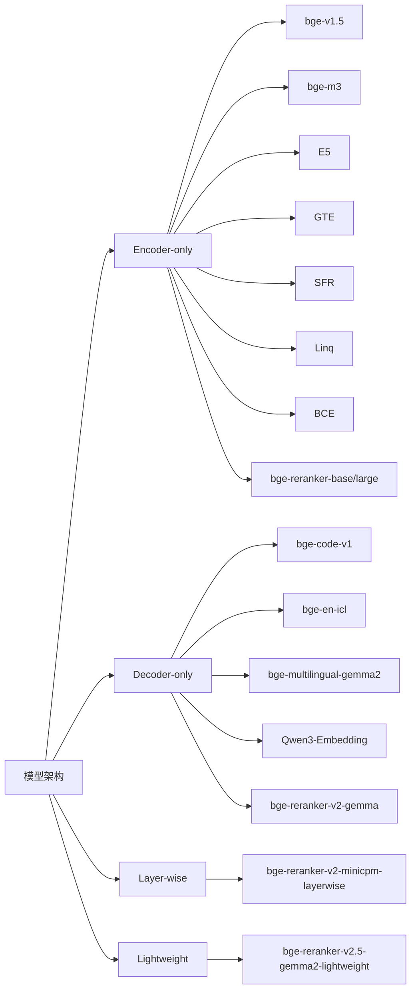
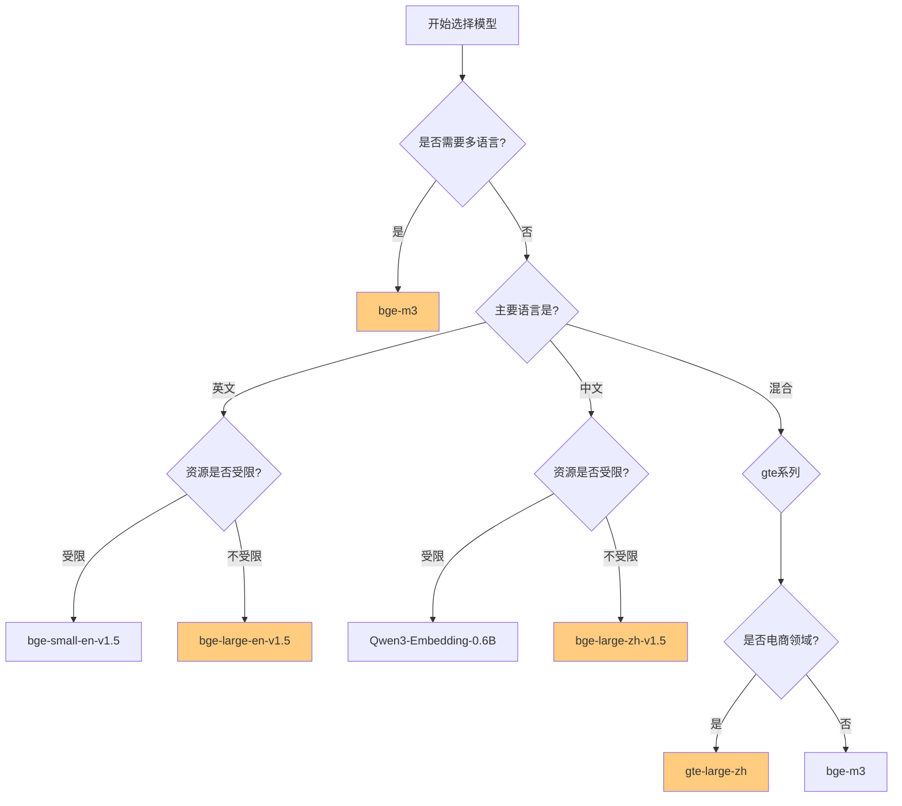
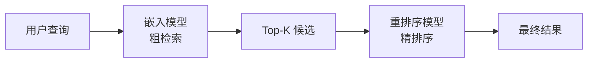

# FlagEmbedding 支持的嵌入与重排序模型综述

本文档全面综述 FlagEmbedding 库支持的所有嵌入（Embedder）和重排序（Reranker）模型，包括模型特点、性能、适用场景以及完整的模型生态系统。

## 目录

- [摘要与项目背景](#摘要与项目背景)
- [模型生态系统思维图](#模型生态系统思维图)
- [嵌入模型（Embedder）综述](#嵌入模型embedder综述)
  - [BGE 系列模型](#bge-系列模型)
  - [Qwen3-Embedding 系列](#qwen3-embedding-系列)
  - [E5 系列模型](#e5-系列模型)
  - [GTE 系列模型](#gte-系列模型)
  - [SFR 系列模型](#sfr-系列模型)
  - [Linq 模型](#linq-模型)
  - [BCE 模型](#bce-模型)
- [重排序模型（Reranker）综述](#重排序模型reranker综述)
  - [BGE 系列重排序器](#bge-系列重排序器)
  - [Jina 系列重排序器](#jina-系列重排序器)
  - [GTE 系列重排序器](#gte-系列重排序器)
  - [BCE 重排序器](#bce-重排序器)
- [模型分类与对比](#模型分类与对比)
- [模型选择指南](#模型选择指南)
- [总结与展望](#总结与展望)

---

## 摘要与项目背景

### FlagEmbedding 项目简介

FlagEmbedding 是北京智源人工智能研究院（BAAI）开发的开源嵌入和重排序模型框架，专注于检索增强大语言模型（RAG）领域。该项目提供了一套完整的工具链，包括推理、微调、评估和数据集，支持多种架构的嵌入和重排序模型。

**核心优势：**
- 统一的 API 接口，支持多种主流模型
- 完整的推理、微调和评估工具链
- 多语言、多功能、多粒度的模型支持
- 活跃的社区和持续的技术更新

### 综述目标

本综述旨在：
1. 系统梳理 FlagEmbedding 支持的所有模型
2. 分析各模型的特点、性能和适用场景
3. 提供模型选择的最佳实践指南
4. 展示完整的模型生态系统

---

## 模型生态系统思维图



---

## 嵌入模型（Embedder）综述

### BGE 系列模型

🎯 **核心定位：** 全能型，完整生态系统

**差异化亮点：**
- ✅ **唯一支持三功能融合**（dense + sparse + ColBERT）
- ✅ **最长文本支持**（8192 token）
- ✅ **最多语言覆盖**（100+）
- ✅ **完整微调工具链**
- ✅ **中国本土研发，社区活跃**

BGE（BAAI General Embedding）系列是 FlagEmbedding 的核心模型，由北京智源人工智能研究院自主研发。

#### BGE v1.0 系列

| 模型名称 | 语言 | 规模 | 说明 |
|---------|------|------|------|
| bge-large-en | English | Large | 英文大模型 |
| bge-base-en | English | Base | 英文基础模型 |
| bge-small-en | English | Small | 英文小模型 |
| bge-large-zh | Chinese | Large | 中文大模型 |
| bge-base-zh | Chinese | Base | 中文基础模型 |
| bge-small-zh | Chinese | Small | 中文小模型 |

**技术特点：**
- 基于 Encoder-only 架构
- 使用 CLS pooling 策略
- 查询指令格式：
  - 英文：`Represent this sentence for searching relevant passages: `
  - 中文：`为这个句子生成表示以用于检索相关文章：`

**适用场景：**
- 通用文本检索
- 语义相似度计算
- 问答系统

**代码引用：**
```python
from FlagEmbedding import FlagAutoModel

model = FlagAutoModel.from_finetuned('BAAI/bge-large-en-v1.5')
```

#### BGE v1.5 系列

v1.5 是 v1.0 的升级版本，主要改进：

| 模型名称 | 语言 | 规模 | 改进点 |
|---------|------|------|--------|
| bge-large-en-v1.5 | English | Large | 相似度分布更合理 |
| bge-base-en-v1.5 | English | Base | 无指令检索能力提升 |
| bge-small-en-v1.5 | English | Small | 小模型性能优化 |
| bge-large-zh-v1.5 | Chinese | Large | 中文检索优化 |
| bge-base-zh-v1.5 | Chinese | Base | 中文检索优化 |
| bge-small-zh-v1.5 | Chinese | Small | 中文检索优化 |

**核心改进：**
1. 缓解相似度分布问题
2. 提升无指令情况下的检索能力
3. 在 MTEB 和 C-MTEB 榜单上取得最佳性能

#### BGE-M3 模型（重点介绍）

**模型名称：** `bge-m3`

**核心特性：**
- **多功能（Multi-function）**：同时支持稠密、稀疏、多向量检索
- **多语言（Multilingual）**：支持 100+ 种语言
- **多粒度（Multi-granularity）**：支持最长 8192 长度的输入文本

**技术架构：**
- Encoder-only 架构
- 同时输出多种表示
- 支持混合检索策略

**检索能力：**
1. **稠密检索（Dense Retrieval）**：传统的向量检索
2. **稀疏检索（Sparse Retrieval）**：基于词袋的检索
3. **多向量检索（ColBERT）**：细粒度的 token 级匹配

**适用场景：**
- 多语言检索系统
- 长文档检索
- 高精度混合检索
- 企业级知识库应用

**代码引用：**
```python
from FlagEmbedding import BGEM3FlagModel

model = BGEM3FlagModel('BAAI/bge-m3', use_fp16=True)

# 多种嵌入方式
embeddings = model.encode(['文本内容'], return_dense=True, return_sparse=True, return_colbert_vecs=True)
```

**文件位置：** [FlagEmbedding/inference/embedder/encoder_only/m3.py](file:///workspace/FlagEmbedding/inference/embedder/encoder_only/m3.py)

#### BGE 专用模型系列

##### 1. bge-code-v1

**特点：**
- 专为代码嵌入设计
- 基于 Decoder-only 架构
- 使用 Last token pooling
- 查询指令格式：`<instruct>{}\n<query>{}`

**适用场景：**
- 代码检索
- 代码相似度计算
- 代码推荐系统

##### 2. bge-en-icl

**特点：**
- 支持上下文学习（In-Context Learning）
- 基于 Decoder-only 架构
- 可以通过示例提升检索效果
- 查询指令格式：`<instruct>{}\n<query>{}`

**技术优势：**
- 通过少量示例编码语义更丰富的查询
- 增强嵌入的语义表征能力
- 灵活适应不同任务

##### 3. bge-multilingual-gemma2

**特点：**
- 基于 Gemma-2-9b 的多语言模型
- Decoder-only 架构
- 支持多种语言和多样下游任务
- 在 MIRACL, MTEB-fr, MTEB-pl 上取得最佳结果

##### 4. bge-reasoner-embed-qwen3-8b-0923

**特点：**
- 推理增强嵌入模型
- 基于 Qwen3-8B
- 查询指令格式：`Instruct: {}\nQuery: {}`

**模型映射文件：** [FlagEmbedding/inference/embedder/model_mapping.py](file:///workspace/FlagEmbedding/inference/embedder/model_mapping.py#L42-L111)

---

### Qwen3-Embedding 系列

🎯 **核心定位：** 通义千问原生，中文优化

**差异化亮点：**
- ✅ **Decoder-only 架构**（与其他 Encoder-only 不同）
- ✅ **大模型原生对齐**（Qwen3 系列）
- ✅ **超丰富规模选择**（0.6B/4B/8B）
- ✅ **阿里云生态深度集成**
- ✅ **中文理解优势明显**

Qwen3-Embedding 是通义千问 Qwen3 系列的嵌入模型。

| 模型名称 | 参数量 | 架构 | Pooling |
|---------|--------|------|---------|
| Qwen3-Embedding-0.6B | 0.6B | Decoder-only | Last token |
| Qwen3-Embedding-4B | 4B | Decoder-only | Last token |
| Qwen3-Embedding-8B | 8B | Decoder-only | Last token |

**特点：**
- 基于通义千问 Qwen3 系列
- Decoder-only 架构
- 查询指令格式：`Instruct: {}\nQuery:{}`
- 提供不同规模的选择，平衡性能和资源消耗

**适用场景：**
- 通用文本嵌入
- 中文为主的检索任务
- 需要不同规模模型的场景

**模型映射：** [FlagEmbedding/inference/embedder/model_mapping.py](file:///workspace/FlagEmbedding/inference/embedder/model_mapping.py#L114-L127)

---

### E5 系列模型

🎯 **核心定位：** 经典稳定，广泛验证

**差异化亮点：**
- ✅ **Mean pooling 设计**（与 BGE 的 CLS pooling 不同）
- ✅ **微软背书，成熟度高**
- ✅ **早期标杆模型，大量文献引用**
- ✅ **稳定性和兼容性好**
- ✅ **多语言版本成熟**

E5（Embedding v5）系列是 Microsoft 开发的嵌入模型。

#### 基础 E5 模型

| 模型名称 | 规模 | Pooling |
|---------|------|---------|
| e5-large | Large | Mean |
| e5-base | Base | Mean |
| e5-small | Small | Mean |

#### E5 v2 模型

| 模型名称 | 规模 | 改进 |
|---------|------|------|
| e5-large-v2 | Large | 性能优化 |
| e5-base-v2 | Base | 性能优化 |
| e5-small-v2 | Small | 性能优化 |

#### E5-Mistral-7B

**特点：**
- 基于 Mistral-7B
- Decoder-only 架构
- Last token pooling
- 查询指令格式：`Instruct: {}\nQuery: {}`

#### Multilingual E5 系列

| 模型名称 | 特点 |
|---------|------|
| multilingual-e5-large | 多语言大模型 |
| multilingual-e5-base | 多语言基础模型 |
| multilingual-e5-small | 多语言小模型 |
| multilingual-e5-large-instruct | 支持指令的多语言大模型 |

**适用场景：**
- 英文为主的检索任务
- 多语言检索
- 企业级应用

**模型映射：** [FlagEmbedding/inference/embedder/model_mapping.py](file:///workspace/FlagEmbedding/inference/embedder/model_mapping.py#L130-L176)

---

### GTE 系列模型

🎯 **核心定位：** 电商优化，中英混合

**差异化亮点：**
- ✅ **阿里生态深度集成
- ✅ **电商领域特别优化
- ✅ **中英文混合场景最佳
- ✅ **GTE-Qwen 系列支持大模型
- ✅ **Mean + CLS 双策略混合

GTE（General Text Embedding）系列是阿里巴巴开发的嵌入模型。

#### GTE 基础版

| 模型名称 | 语言 | Pooling |
|---------|------|---------|
| gte-large | English | Mean |
| gte-base | English | Mean |
| gte-small | English | Mean |
| gte-large-zh | Chinese | CLS |
| gte-base-zh | Chinese | CLS |
| gte-small-zh | Chinese | CLS |

#### GTE v1.5

| 模型名称 | 特点 |
|---------|------|
| gte-large-en-v1.5 | 英文 v1.5 大模型 |
| gte-base-en-v1.5 | 英文 v1.5 基础模型 |

#### GTE-Qwen 系列

| 模型名称 | 特点 |
|---------|------|
| gte-Qwen2-7B-instruct | 基于 Qwen2-7B 的指令模型 |
| gte-Qwen2-1.5B-instruct | 基于 Qwen2-1.5B 的指令模型 |
| gte-Qwen1.5-7B-instruct | 基于 Qwen1.5-7B 的指令模型 |

#### GTE 多语言

| 模型名称 | 特点 |
|---------|------|
| gte-multilingual-base | 多语言基础模型 |

**特点：**
- 支持中英文
- 提供多种规模选择
- GTE-Qwen 系列基于通义千问架构

**适用场景：**
- 中英文混合检索
- 电商领域应用
- 阿里云生态系统集成

**模型映射：** [FlagEmbedding/inference/embedder/model_mapping.py](file:///workspace/FlagEmbedding/inference/embedder/model_mapping.py#L179-L228)

---

### SFR 系列模型

SFR（Salesforce Representations）系列是 Salesforce 开发的嵌入模型。

| 模型名称 | 特点 |
|---------|------|
| SFR-Embedding-Mistral | 基于 Mistral 架构 |
| SFR-Embedding-2_R | 第二代 SFR 嵌入模型 |

**共同特点：**
- Decoder-only 架构
- Last token pooling
- 查询指令格式：`Instruct: {}\nQuery: {}`

**适用场景：**
- 企业级应用
- 与 Salesforce 生态集成
- 英文检索任务

**模型映射：** [FlagEmbedding/inference/embedder/model_mapping.py](file:///workspace/FlagEmbedding/inference/embedder/model_mapping.py#L231-L240)

---

### Linq 模型

| 模型名称 | 特点 |
|---------|------|
| Linq-Embed-Mistral | 基于 Mistral 的 Linq 嵌入 |

**特点：**
- Decoder-only 架构
- Last token pooling
- 查询指令格式：`Instruct: {}\nQuery: {}`

**适用场景：**
- 特定领域检索
- 与 Linq 生态集成

**模型映射：** [FlagEmbedding/inference/embedder/model_mapping.py](file:///workspace/FlagEmbedding/inference/embedder/model_mapping.py#L243-L248)

---

### BCE 模型

| 模型名称 | 特点 |
|---------|------|
| bce-embedding-base_v1 | BCE 基础嵌入模型 |

**特点：**
- Encoder-only 架构
- CLS pooling

**适用场景：**
- 中文检索
- BCE 生态系统

**模型映射：** [FlagEmbedding/inference/embedder/model_mapping.py](file:///workspace/FlagEmbedding/inference/embedder/model_mapping.py#L251-L256)

---

## 重排序模型（Reranker）综述

重排序模型（Reranker）通常用于在初步检索后，对候选文档进行更精细的相关性排序，提升最终检索质量。

### BGE 系列重排序器

BGE 系列重排序器是 FlagEmbedding 的核心重排序模型。

| 模型名称 | 架构 | 特点 |
|---------|------|------|
| bge-reranker-base | Encoder-only | 基础重排序模型 |
| bge-reranker-large | Encoder-only | 大型重排序模型，精度更高 |
| bge-reranker-v2-m3 | Encoder-only | 多语言轻量级模型，易于部署 |
| bge-reranker-v2-gemma | Decoder-only | 基于 Gemma，多语言支持 |
| bge-reranker-v2-minicpm-layerwise | Decoder-only | 分层架构，支持选择输出层加速 |
| bge-reranker-v2.5-gemma2-lightweight | Decoder-only | 轻量级，支持压缩和分层操作 |

#### 详细说明

##### 1. bge-reranker-base & large

**特点：**
- Encoder-only 架构
- 交叉编码器（Cross-encoder）模型
- 精度比向量模型更高
- 推理效率相对较低

**适用场景：**
- 高精度重排序
- 中英文混合场景
- 对检索质量要求高的应用

##### 2. bge-reranker-v2-m3

**特点：**
- 轻量级交叉编码器
- 强大的多语言能力
- 易于部署
- 快速推理

##### 3. bge-reranker-v2-gemma

**特点：**
- 基于 Gemma 架构
- 支持多语言
- 英文和多语言表现出色

##### 4. bge-reranker-v2-minicpm-layerwise

**特点：**
- 分层（Layer-wise）架构
- 允许自由选择输出层
- 支持推理加速
- 中英文表现良好

##### 5. bge-reranker-v2.5-gemma2-lightweight

**特点：**
- 基于 Gemma-2
- 轻量级设计
- 支持令牌压缩
- 分层轻量操作
- 节省资源的同时保持良好性能

**使用示例：**
```python
from FlagEmbedding import FlagAutoReranker

reranker = FlagAutoReranker.from_finetuned('BAAI/bge-reranker-large')

scores = reranker.compute_score([
    ('查询', '文档1'),
    ('查询', '文档2')
])
```

**模型映射文件：** [FlagEmbedding/inference/reranker/model_mapping.py](file:///workspace/FlagEmbedding/inference/reranker/model_mapping.py#L31-L56)

---

### Jina 系列重排序器

| 模型名称 | 特点 |
|---------|------|
| jinaai/jina-reranker-v2-base-multilingual | 多语言基础重排序器 |
| jinaai/jina-reranker-v1-turbo-en | 英文 Turbo 版本 |

**特点：**
- Encoder-only 架构
- Jina AI 开发
- 多语言支持

**适用场景：**
- 多语言检索
- Jina 生态系统集成
- 需要快速推理的场景

**模型映射：** [FlagEmbedding/inference/reranker/model_mapping.py](file:///workspace/FlagEmbedding/inference/reranker/model_mapping.py#L59-L73)

---

### GTE 系列重排序器

| 模型名称 | 特点 |
|---------|------|
| Alibaba-NLP/gte-multilingual-reranker-base | GTE 多语言重排序器 |

**特点：**
- Encoder-only 架构
- 阿里巴巴开发
- 多语言支持

**适用场景：**
- 电商领域
- 中英文混合场景
- 阿里云生态集成

**模型映射：** [FlagEmbedding/inference/reranker/model_mapping.py](file:///workspace/FlagEmbedding/inference/reranker/model_mapping.py#L63-L65)

---

### BCE 重排序器

| 模型名称 | 特点 |
|---------|------|
| maidalun1020/bce-reranker-base_v1 | BCE 重排序器 |

**特点：**
- Encoder-only 架构
- BCE 生态系统

**适用场景：**
- 中文检索
- BCE 生态集成

**模型映射：** [FlagEmbedding/inference/reranker/model_mapping.py](file:///workspace/FlagEmbedding/inference/reranker/model_mapping.py#L67-L69)

---

## 🚀 各模型系统差异化核心对比

### 🔥 各模型系列独特卖点（USP）

| 模型系列 | 开发机构 | **独特优势** | **最大亮点** | **核心差异** |
|---------|---------|-------------|------------|-----------|
| **BGE** | BAAI | 多功能、多语言、完整工具链 | **bge-m3 的三功能融合** | 中国本土开发，完整生态系统 |
| **Qwen3** | 阿里巴巴 | 通义千问原生，中文优化 | **Decoder-only 架构 + 多种规模** | 通义千问生态，中文专注 |
| **E5** | Microsoft | 经典稳定，广泛使用 | **Mean pooling 设计** | 微软背书，成熟度高 |
| **GTE** | 阿里巴巴 | 中英文混合，电商优化 | **阿里云生态集成** | 电商领域特别优化 |
| **SFR** | Salesforce | 企业级优化 | **Salesforce 生态** | 企业应用集成优势 |
| **Linq** | Linq | 特定领域 | **生态整合** | 特定领域优化 |
| **BCE** | 百度 | 百度生态 | **中文检索** | 百度技术栈整合 |



### 🎯 架构设计差异化对比

| 维度 | **BGE 系列** | **Qwen3** | **E5** | **GTE** |
|-----|-------------|-----------|-------|-------|
| **主要架构** | Encoder-only 为主 | Decoder-only | Encoder-only | 混合架构 |
| **Pooling 策略** | CLS | Last Token | Mean | CLS/Mean |
| **多功能支持** | ✅ 三功能（bge-m3） | ❌ | ❌ | ❌ |
| **长文本支持** | 8192（bge-m3） | 标准 | 标准 | 标准 |
| **模型规模** | Small/Base/Large | 0.6B/4B/8B | Small/Base/Large | Small/Base/Large/7B |
| **语言重点** | 中英为主 + 100+ | 中文 | 英文为主 | 中英 + 多语言 |
| **技术特色** | 对比学习优化 | 大模型对齐 | 渐进式优化 | 领域适配 |

---

## 📊 模型分类与对比

### 按架构分类



### 按功能分类

| 分类 | 模型示例 | 特点 |
|-----|---------|------|
| 基础嵌入 | bge-v1.5, E5, GTE | 通用文本嵌入 |
| 多功能嵌入 | bge-m3 | 稠密+稀疏+多向量 |
| 上下文学习 | bge-en-icl | 支持 In-Context Learning |
| 代码专用 | bge-code-v1 | 代码嵌入 |
| 多语言 | bge-m3, bge-multilingual-gemma2 | 支持多语言 |
| 长文本 | bge-m3 (8192) | 支持长输入 |

### 🔍 使用场景对比决策表

| 场景 | **首选模型** | **次选模型** | **原因分析** |
|-----|------------|------------|-----------|
| 多语言混合检索 | **bge-m3** | multilingual-e5-large | BGE-M3 支持100+语言，三功能融合 |
| 纯英文高精度检索 | bge-large-en-v1.5 | e5-large-v2 | BGE v1.5 在英文榜单领先 |
| 纯中文检索 | bge-large-zh-v1.5 | gte-large-zh | BGE v1.5 中文优化，Qwen3 备选 |
| 电商领域应用 | gte-large-zh | bge-m3 | GTE 电商优化，中英文混合 |
| 企业级Salesforce集成 | SFR-Embedding-Mistral | - | 原生生态支持 |
| 资源受限部署 | Qwen3-Embedding-0.6B | bge-small-*-v1.5 | 0.6B超轻量，性能优秀 |
| 长文档处理 | bge-m3 | - | 支持8192超长输入 |
| 代码检索 | bge-code-v1 | - | 代码专用模型 |
| 需要上下文学习 | bge-en-icl | - | ICL支持 |



### 性能对比表

#### 嵌入模型性能对比

| 模型系列 | 参数量级 | 推理速度 | 内存占用 | 检索精度 | 多语言 | 适用场景 |
|---------|---------|---------|---------|---------|--------|---------|
| BGE v1.5 Small | Small | ⭐⭐⭐⭐⭐ | ⭐⭐⭐⭐⭐ | ⭐⭐⭐ | ❌ | 快速原型、资源受限 |
| BGE v1.5 Base | Base | ⭐⭐⭐⭐ | ⭐⭐⭐⭐ | ⭐⭐⭐⭐ | ❌ | 通用应用、平衡性能 |
| BGE v1.5 Large | Large | ⭐⭐⭐ | ⭐⭐⭐ | ⭐⭐⭐⭐⭐ | ❌ | 高精度要求 |
| BGE-M3 | Large | ⭐⭐⭐ | ⭐⭐⭐ | ⭐⭐⭐⭐⭐ | ✅ | 多语言、长文本、混合检索 |
| Qwen3-Embedding-0.6B | 0.6B | ⭐⭐⭐⭐⭐ | ⭐⭐⭐⭐⭐ | ⭐⭐⭐ | ❌ | 中文应用、快速部署 |
| Qwen3-Embedding-8B | 8B | ⭐⭐ | ⭐⭐ | ⭐⭐⭐⭐⭐ | ❌ | 中文高精度应用 |
| E5 Small | Small | ⭐⭐⭐⭐⭐ | ⭐⭐⭐⭐⭐ | ⭐⭐⭐ | ❌ | 英文快速应用 |
| E5 Large | Large | ⭐⭐⭐ | ⭐⭐⭐ | ⭐⭐⭐⭐⭐ | ❌ | 英文高精度 |
| GTE | Mixed | ⭐⭐⭐⭐ | ⭐⭐⭐⭐ | ⭐⭐⭐⭐ | ✅ | 中英文混合、电商 |
| SFR | 7B | ⭐⭐ | ⭐⭐ | ⭐⭐⭐⭐⭐ | ❌ | 企业级英文应用 |

*注：⭐ 越多表示越好/越大/越快*

#### 重排序模型性能对比

| 模型 | 架构 | 推理速度 | 精度 | 多语言 | 资源占用 |
|-----|------|---------|------|--------|---------|
| bge-reranker-base | Encoder-only | ⭐⭐⭐⭐ | ⭐⭐⭐⭐ | ✅ | ⭐⭐⭐⭐ |
| bge-reranker-large | Encoder-only | ⭐⭐⭐ | ⭐⭐⭐⭐⭐ | ✅ | ⭐⭐⭐ |
| bge-reranker-v2-m3 | Encoder-only | ⭐⭐⭐⭐⭐ | ⭐⭐⭐⭐ | ✅ | ⭐⭐⭐⭐⭐ |
| bge-reranker-v2-gemma | Decoder-only | ⭐⭐⭐ | ⭐⭐⭐⭐⭐ | ✅ | ⭐⭐⭐ |
| bge-reranker-v2-minicpm-layerwise | Decoder-only | ⭐⭐⭐⭐ | ⭐⭐⭐⭐⭐ | ✅ | ⭐⭐⭐⭐ |
| bge-reranker-v2.5-gemma2-lightweight | Decoder-only | ⭐⭐⭐⭐⭐ | ⭐⭐⭐⭐ | ✅ | ⭐⭐⭐⭐⭐ |

### Pooling 策略对比

| Pooling 方法 | 适用模型 | 特点 |
|-------------|---------|------|
| CLS | BGE v1/v1.5, BGE-M3, GTE, BCE | 使用<[BOS_never_used_51bce0c785ca2f68081bfa7d91973934]> token 表示，简单有效 |
| Mean | E5, GTE 基础版 | 使用所有 token 的平均表示 |
| Last token | Decoder-only 系列 | 使用最后一个 token，适合自回归模型 |

**配置文件：** [FlagEmbedding/inference/embedder/model_mapping.py](file:///workspace/FlagEmbedding/inference/embedder/model_mapping.py#L27-L39)

### 💡 各模型系统设计理念差异

| 模型系列 | **设计理念** | **优化重点** | **技术路线** | **权衡取舍** |
|---------|-------------|------------|-----------|------------|
| **BGE** | **多功能 + 全生态** | 检索效果 + 工具完善 | Encoder-only为主，对比学习 | 功能丰富度 > 极致单场景性能 |
| **Qwen3** | **大模型原生对齐** | 中文理解 + 生态集成 | Decoder-only，大模型技术路线 | 大模型优势 > 极致轻量化 |
| **E5** | **经典稳健** | 稳定性 + 兼容性 | Mean pooling，渐进优化 | 成熟稳定 > 前沿功能 |
| **GTE** | **垂直领域优化** | 电商 + 中英文 | 混合架构，领域适配 | 领域适配 > 通用能力 |
| **SFR/Linq** | **企业集成** | 生态适配 + 企业级 | Decoder-only，企业定制 | 生态整合 > 广泛通用性 |
| **BCE** | **百度生态** | 中文 + 百度栈 | Encoder-only，百度技术路线 | 生态整合 > 多平台适应 |

### 📈 各模型技术路线对比图

```mermaid
flowchart LR
    A[技术路线选择] --> B[Encoder-only 路线]
    A --> C[Decoder-only 路线]
    
    B --> B1[BGE系列]
    B --> B2[E5系列]
    B --> B3[GTE基础版]
    B --> B4[BCE]
    
    C --> C1[Qwen3系列]
    C --> C2[bge-code-v1]
    C --> C3[bge-en-icl]
    C --> C4[SFR系列]
    
    style B1 fill:#ffcccc
    style B2 fill:#ccffcc
    style C1 fill:#ccccff
    
    note over B
        CLS/Mean pooling
        计算高效
        成熟稳定
    end
    
    note over C
        Last token pooling
        大模型技术
        生态整合好
    end
```

---

## 🎯 模型选择指南

### 根据场景选择模型

#### 场景 1：通用英文检索

**推荐模型：**
- 高精度：`bge-large-en-v1.5` 或 `e5-large-v2`
- 平衡性能：`bge-base-en-v1.5`
- 资源受限：`bge-small-en-v1.5`

**重排序增强：** `bge-reranker-large`

#### 场景 2：通用中文检索

**推荐模型：**
- 高精度：`bge-large-zh-v1.5`
- 平衡性能：`bge-base-zh-v1.5`
- 资源受限：`bge-small-zh-v1.5` 或 `Qwen3-Embedding-0.6B`

**重排序增强：** `bge-reranker-large`

#### 场景 3：多语言检索

**推荐模型：**
- 首选：`bge-m3`（多功能 + 多语言 + 长文本）
- 备选：`bge-multilingual-gemma2` 或 `multilingual-e5-large`

**重排序增强：** `bge-reranker-v2-m3`

#### 场景 4：长文档检索

**推荐模型：**
- `bge-m3`（支持最长 8192）

**重排序增强：** `bge-reranker-v2-gemma` 或 `bge-reranker-v2.5-gemma2-lightweight`

#### 场景 5：代码检索

**推荐模型：**
- `bge-code-v1`

#### 场景 6：电商/中英文混合

**推荐模型：**
- GTE 系列：`gte-large-zh` 或 `gte-multilingual-base`
- 备选：`bge-m3`

**重排序增强：** `gte-multilingual-reranker-base`

#### 场景 7：需要灵活性和示例学习

**推荐模型：**
- `bge-en-icl`（支持上下文学习）

### 平衡性能与资源

#### 资源受限场景（CPU/小内存）

**推荐配置：**
- 嵌入模型：`bge-small-en-v1.5` / `bge-small-zh-v1.5` / `Qwen3-Embedding-0.6B`
- 重排序模型：`bge-reranker-v2-m3` 或 `bge-reranker-v2.5-gemma2-lightweight`
- 参数设置：`use_fp16=True`

#### 中等资源场景（单 GPU）

**推荐配置：**
- 嵌入模型：`bge-base-en-v1.5` / `bge-base-zh-v1.5`
- 重排序模型：`bge-reranker-base` 或 `bge-reranker-v2-minicpm-layerwise`
- 参数设置：`use_fp16=True`，合理 batch size

#### 充足资源场景（多 GPU）

**推荐配置：**
- 嵌入模型：`bge-large-en-v1.5` / `bge-large-zh-v1.5` / `bge-m3`
- 重排序模型：`bge-reranker-large` 或 `bge-reranker-v2-gemma`
- 参数设置：多设备并行，大 batch size

### 最佳实践建议

#### 1. 两阶段检索流程



**优点：**
- 嵌入模型快速筛选大量文档
- 重排序模型提升精度
- 平衡效率和效果

#### 2. 指令使用

对于支持查询指令的模型，始终使用推荐的指令格式：

```python
# BGE v1.5 英文
query_instruction = "Represent this sentence for searching relevant passages: "

# BGE v1.5 中文
query_instruction = "为这个句子生成表示以用于检索相关文章："

# Decoder-only 模型
query_instruction = "Instruct: {}\nQuery: {}"
```

#### 3. 批量推理

充分利用批量推理提升效率：

```python
# 推荐
embeddings = model.encode(large_corpus, batch_size=256)

# 避免逐条编码
for doc in large_corpus:
    embedding = model.encode(doc)  # 低效
```

#### 4. 多设备并行

对于大规模数据，使用多设备并行：

```python
model = FlagAutoModel.from_finetuned(
    'BAAI/bge-large-en-v1.5',
    devices=[0, 1, 2, 3]  # 使用多个 GPU
)
```

#### 5. 混合检索策略

对于 bge-m3，可以利用多种检索方式：

```python
# 1. 稠密检索
dense_scores = dense_embeddings @ query_dense_embedding.T

# 2. 稀疏检索
sparse_scores = compute_sparse_similarity(sparse_embeddings, query_sparse_embedding)

# 3. 多向量检索
colbert_scores = compute_colbert_similarity(colbert_vecs, query_colbert_vecs)

# 4. 混合打分
final_scores = 0.6 * dense_scores + 0.2 * sparse_scores + 0.2 * colbert_scores
```

### 📌 核心差异化总结卡片

```mermaid
mindmap
  root((核心差异化核心差异))
    技术路线
      Encoder-only
        CLS pooling
          BGE/GTE/E5/BCE
        Mean pooling
          E5/GTE
      Decoder-only
        Last token
          Qwen3/SFR
        大模型技术
    功能差异
      单功能
        BGE-v1.5/E5/GTE
      多功能
        BGE-M3 (3功能
    语言聚焦
      英文为主
        E5/SFR
      中文为主
        BGE-zh/Qwen3
      多语言
        BGE-M3
    生态整合
      完整工具链
        BGE
      大模型生态
        Qwen3/GTE
      企业生态
        SFR/Linq
      百度生态
        BCE
```

| **一句话总结各系统核心差异：**

- **BGE**：**最全能选手**，**唯一支持三功能融合、100+语言、完整工具链
- **Qwen3**：**大模型原生**，Decoder-only架构、通义千问生态、中文优化
- **E5**：**经典稳定派**，微软背书、Mean pooling、成熟稳定
- **GTE**：**领域优化**，阿里生态、电商优化、中英文混合
- **SFR/Linq**：**企业级**，生态整合、Salesforce/Linq生态
- **BCE**：**百度系**，中文、百度生态

---

## 总结与展望

### FlagEmbedding 模型生态总结

FlagEmbedding 构建了一个完整、丰富的模型生态系统：

1. **全面的模型支持**
   - 7 个嵌入模型系列（BGE、Qwen3、E5、GTE、SFR、Linq、BCE）
   - 4 个重排序模型系列（BGE、Jina、GTE、BCE）
   - 覆盖 Encoder-only 和 Decoder-only 架构

2. **多样化的功能**
   - 从通用嵌入到专用模型
   - 从基础检索到多功能混合检索
   - 从单语言到多语言支持

3. **完整的工具链**
   - 推理接口统一
   - 微调工具完善
   - 评估基准齐全

### 技术亮点

1. **统一抽象**：通过抽象基类实现不同模型的统一接口
2. **自动加载**：智能模型映射，简化使用
3. **多设备支持**：支持多种硬件设备和并行推理
4. **研究导向**：持续集成最新研究成果

### 未来发展方向

基于 FlagEmbedding 的发展轨迹，未来可能的发展方向：

1. **模型规模扩展**
   - 更大规模的模型
   - 更高效的小模型
   - 领域专用模型

2. **功能增强**
   - 更强的多模态支持
   - 更好的长文本处理
   - 更灵活的混合检索

3. **效率优化**
   - 更快的推理速度
   - 更低的内存占用
   - 更好的硬件适配

4. **生态完善**
   - 更多模型支持
   - 更丰富的工具
   - 更活跃的社区

### 对社区的贡献

FlagEmbedding 为检索增强大语言模型领域做出了重要贡献：

1. **开源高质量模型**：BGE 系列模型在多个榜单取得领先成绩
2. **完整工具链**：提供从推理、微调到评估的全套工具
3. **研究成果转化**：将最新研究成果快速转化为实用工具
4. **标准化接口**：推动嵌入和重排序模型的接口标准化

---

## 附录

### 完整支持的模型列表

#### 嵌入模型（共 40+ 个）

详细列表请参考：[FlagEmbedding/inference/embedder/model_mapping.py](file:///workspace/FlagEmbedding/inference/embedder/model_mapping.py)

#### 重排序模型（共 9 个）

详细列表请参考：[FlagEmbedding/inference/reranker/model_mapping.py](file:///workspace/FlagEmbedding/inference/reranker/model_mapping.py)

### 相关资源

- [项目 GitHub](https://github.com/FlagOpen/FlagEmbedding)
- [HuggingFace 模型库](https://huggingface.co/BAAI)
- [官方文档](https://flagembedding.readthedocs.io/)
- [教程 Notebook](./../Tutorials/)

### 参考文献

1. C-Pack: Packaged Resources To Advance General Chinese Embedding (2023)
2. LM-Cocktail: Resilient Tuning of Language Models via Model Merging (2023)
3. Retrieve Anything To Augment Large Language Models (2023)
4. BGE-M3: Multi-lingual, Multi-functional, Multi-granularity Embedding (2024)

---

*本综述基于 FlagEmbedding v1.1 版本编写，最后更新：2024年*
