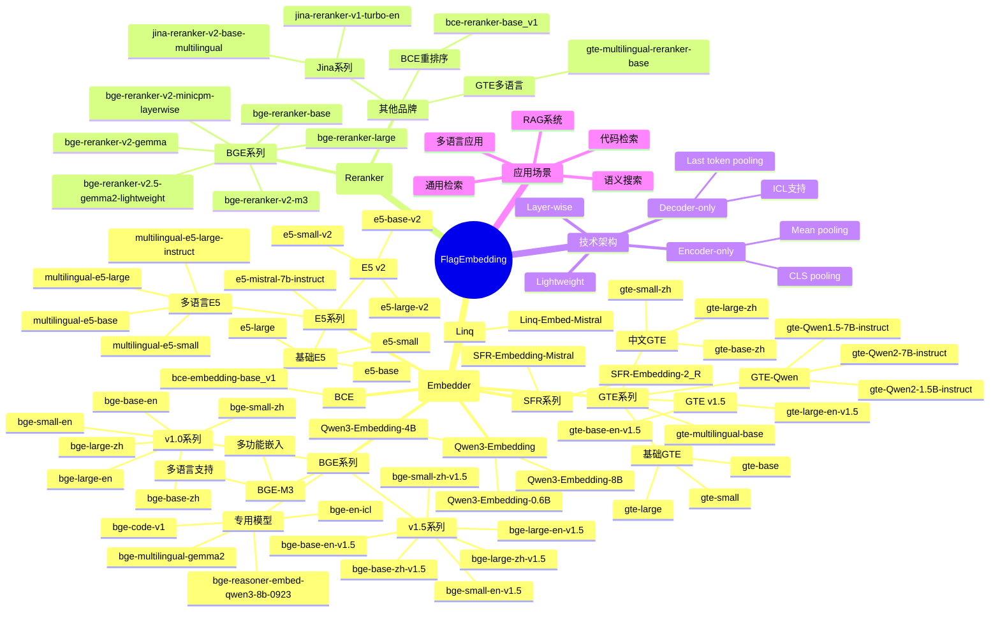
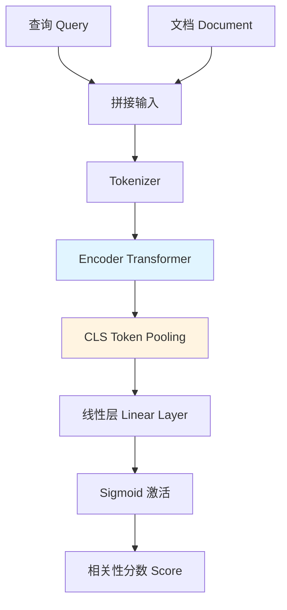
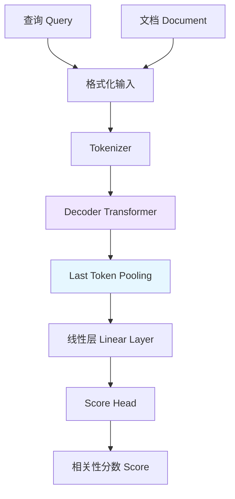
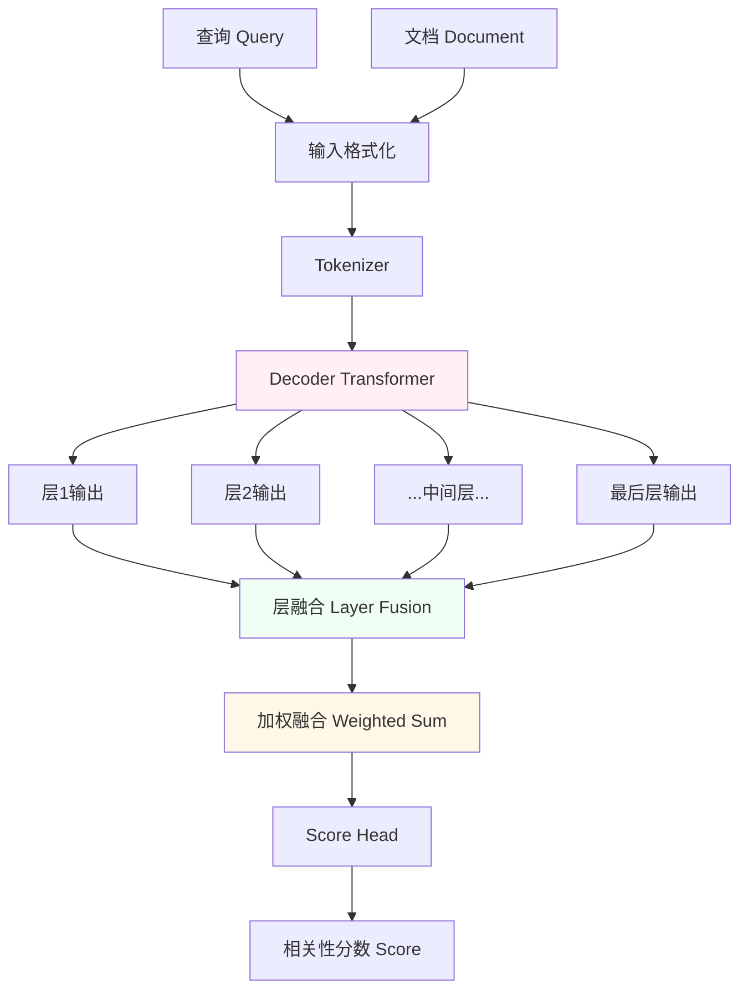

# FlagEmbedding 支持的嵌入及重排模型综述

## 摘要/简介

FlagEmbedding 是由北京智源人工智能研究院（BAAI）开发的一站式检索工具库，为搜索和 RAG（检索增强生成）场景提供强大的嵌入（Embedder）和重排序（Reranker）模型支持。本文综述 FlagEmbedding 库当前支持的所有模型，包括它们的架构特点、性能表现、适用场景等，为用户选择合适的模型提供参考。

## 模型生态思维图



---

## 目录
- [1. 嵌入模型综述](#1-嵌入模型综述)
- [2. 重排序模型综述](#2-重排序模型综述)
- [3. 模型分类与对比](#3-模型分类与对比)
- [4. 技术实现细节](#4-技术实现细节)
- [5. 选择指南](#5-选择指南)
- [6. 总结与展望](#6-总结与展望)

---

## 1. 嵌入模型综述

### 1.1 BGE 系列模型

BGE（BAAI General Embedding）是 FlagEmbedding 的核心产品线，提供了丰富的中英文和多语言嵌入模型。

#### 1.1.1 BGE v1.0 系列

| 模型名称 | 规模 | 语言 | Pooling |
|---------|------|------|---------|
| `bge-large-en` | Large | 英文 | CLS |
| `bge-base-en` | Base | 英文 | CLS |
| `bge-small-en` | Small | 英文 | CLS |
| `bge-large-zh` | Large | 中文 | CLS |
| `bge-base-zh` | Base | 中文 | CLS |
| `bge-small-zh` | Small | 中文 | CLS |

特点：
- 早期 BGE 版本，性能稳定
- 中英双语分别优化
- CLS pooling 策略
- 轻量级模型部署友好

#### 1.1.2 BGE v1.5 系列

| 模型名称 | 规模 | 语言 | Pooling |
|---------|------|------|---------|
| `bge-large-en-v1.5` | Large | 英文 | CLS |
| `bge-base-en-v1.5` | Base | 英文 | CLS |
| `bge-small-en-v1.5` | Small | 英文 | CLS |
| `bge-large-zh-v1.5` | Large | 中文 | CLS |
| `bge-base-zh-v1.5` | Base | 中文 | CLS |
| `bge-small-zh-v1.5` | Small | 中文 | CLS |

特点：
- 相比 v1.0 版本性能大幅提升
- 优化的训练数据和策略
- 在多个基准上达到 SOTA 水平
- 推荐用于生产环境

#### 1.1.3 BGE-M3 模型

`bge-m3` 是 BGE 系列的旗舰产品，具有以下特色：

**核心功能：**
- **多功能嵌入**：同时支持 Dense、Sparse 和 ColBERT 三种表示
- **多语言支持**：支持 100+ 语言的检索任务
- **多粒度输入**：最大支持 8192 token 长度

**技术特点：**
- Dense 表示：CLS token 嵌入，用于全局语义
- Sparse 表示：词汇权重，用于精确匹配
- ColBERT 表示：token 级别嵌入，用于细粒度匹配
- 三种表示融合，在 MTEB 基准上表现优异

适用场景：
- 多语言检索系统
- 需要精确匹配的场景
- 长文本处理

参考代码文件：[model_mapping.py](file:///workspace/FlagEmbedding/inference/embedder/model_mapping.py#L60-L62)

#### 1.1.4 BGE 专用模型

| 模型名称 | 特点 | 适用场景 |
|---------|------|---------|
| `bge-code-v1` | 代码专用嵌入 | 代码搜索、代码库检索 |
| `bge-multilingual-gemma2` | 基于 Gemma2 的多语言模型 | 多语言通用嵌入 |
| `bge-en-icl` | 上下文学习支持 | Few-shot 嵌入任务 |
| `bge-reasoner-embed-qwen3-8b-0923` | Qwen3 8B 推理器嵌入 | RAG 系统中的推理增强 |

### 1.2 Qwen3-Embedding 系列

| 模型名称 | 参数量 | Pooling |
|---------|--------|---------|
| `Qwen3-Embedding-0.6B` | 0.6B | Last Token |
| `Qwen3-Embedding-4B` | 4B | Last Token |
| `Qwen3-Embedding-8B` | 8B | Last Token |

特点：
- Decoder-only 架构，基于 Qwen3 大模型
- 使用 Last Token pooling
- 查询指令格式：`Instruct: {}\nQuery:{}`
- 参数量从 0.6B 到 8B 可选，适应不同资源需求

参考代码文件：[model_mapping.py](file:///workspace/FlagEmbedding/inference/embedder/model_mapping.py#L114-L127)

### 1.3 E5 系列模型

#### 1.3.1 基础 E5 模型

| 模型名称 | 规模 | Pooling |
|---------|------|---------|
| `e5-large` | Large | Mean |
| `e5-base` | Base | Mean |
| `e5-small` | Small | Mean |

#### 1.3.2 E5 v2 模型

| 模型名称 | 规模 | Pooling |
|---------|------|---------|
| `e5-large-v2` | Large | Mean |
| `e5-base-v2` | Base | Mean |
| `e5-small-v2` | Small | Mean |

#### 1.3.3 多语言 E5 系列

| 模型名称 | 特点 | Pooling |
|---------|------|---------|
| `multilingual-e5-large` | 大参数量 | Mean |
| `multilingual-e5-base` | 中等参数量 | Mean |
| `multilingual-e5-small` | 轻量级 | Mean |
| `multilingual-e5-large-instruct` | 带指令支持 | Mean |

#### 1.3.4 E5-Mistral

| 模型名称 | 特点 |
|---------|------|
| `e5-mistral-7b-instruct` | 基于 Mistral 7B，指令支持 |

特点：
- 早期开源嵌入模型的代表
- 使用 Mean pooling 策略
- 多语言 E5 系列支持多种语言
- E5-Mistral-7B 提供更强的语义理解能力

参考代码文件：[model_mapping.py](file:///workspace/FlagEmbedding/inference/embedder/model_mapping.py#L131-L176)

### 1.4 GTE 系列模型

#### 1.4.1 基础 GTE 模型

| 模型名称 | 规模 | Pooling |
|---------|------|---------|
| `gte-large` | Large | Mean |
| `gte-base` | Base | Mean |
| `gte-small` | Small | Mean |

#### 1.4.2 GTE v1.5 模型

| 模型名称 | 规模 | Pooling |
|---------|------|---------|
| `gte-large-en-v1.5` | Large | CLS |
| `gte-base-en-v1.5` | Base | CLS |

#### 1.4.3 中文 GTE 系列

| 模型名称 | 规模 | Pooling |
|---------|------|---------|
| `gte-large-zh` | Large | CLS |
| `gte-base-zh` | Base | CLS |
| `gte-small-zh` | Small | CLS |

#### 1.4.4 GTE-Qwen 系列

| 模型名称 | 特点 |
|---------|------|
| `gte-Qwen2-7B-instruct` | Qwen2 7B，指令支持 |
| `gte-Qwen2-1.5B-instruct` | Qwen2 1.5B，指令支持 |
| `gte-Qwen1.5-7B-instruct` | Qwen1.5 7B，指令支持 |

#### 1.4.5 多语言 GTE

| 模型名称 | 特点 |
|---------|------|
| `gte-multilingual-base` | 多语言基础模型 |

特点：
- 阿里巴巴开源的嵌入模型
- 支持中英文和多语言
- 部分模型需要 `trust_remote_code=True`
- GTE-Qwen 系列基于大语言模型

参考代码文件：[model_mapping.py](file:///workspace/FlagEmbedding/inference/embedder/model_mapping.py#L179-L228)

### 1.5 其他嵌入模型

#### 1.5.1 SFR 系列

| 模型名称 | 特点 |
|---------|------|
| `SFR-Embedding-Mistral` | Salesforce 开源，基于 Mistral |
| `SFR-Embedding-2_R` | Salesforce 最新版本 |

#### 1.5.2 Linq 模型

| 模型名称 | 特点 |
|---------|------|
| `Linq-Embed-Mistral` | Linq 基于 Mistral 的嵌入模型 |

#### 1.5.3 BCE 模型

| 模型名称 | 特点 |
|---------|------|
| `bce-embedding-base_v1` | 百度 BCE 嵌入模型 |

参考代码文件：[model_mapping.py](file:///workspace/FlagEmbedding/inference/embedder/model_mapping.py#L231-L256)

---

## 2. 重排序模型综述

### 2.1 BGE 系列重排序器

| 模型名称 | 架构 | 特点 |
|---------|------|------|
| `bge-reranker-base` | Encoder-only | 基础重排序器 |
| `bge-reranker-large` | Encoder-only | 大参数量版本 |
| `bge-reranker-v2-m3` | Encoder-only | M3 版本重排序器 |
| `bge-reranker-v2-gemma` | Decoder-only | 基于 Gemma 的重排序器 |
| `bge-reranker-v2-minicpm-layerwise` | Decoder-only Layer-wise | 分层输出融合 |
| `bge-reranker-v2.5-gemma2-lightweight` | Decoder-only Lightweight | 轻量级 Gemma2 重排序器 |

#### 2.1.1 Encoder-only 重排序器



`bge-reranker-base`、`bge-reranker-large`、`bge-reranker-v2-m3`：
- 基于 Cross-Encoder 架构
- 将查询和文档拼接输入
- 使用 CLS token 进行分类
- 输出相关性分数
- 性能优异但计算成本较高

#### 2.1.2 Decoder-only 重排序器



`bge-reranker-v2-gemma`：
- 基于 Gemma 大模型
- 使用 Decoder-only 架构
- 使用 Last Token Pooling
- 更强的语义理解能力

#### 2.1.3 Layer-wise 重排序器



`bge-reranker-v2-minicpm-layerwise`：
- 基于 MiniCPM 模型
- 提取多层隐藏状态
- 使用层输出融合技术
- 加权融合多层信息
- 更好的信息利用

#### 2.1.4 Lightweight 重排序器

```mermaid
flowchart TD
    A[查询 Query] --> C
    B[文档 Document] --> C[高效输入处理]
    C --> D[优化 Tokenizer]
    D --> E[轻量级 Decoder]
    E --> F[轻量化 Pooling]
    F --> G[快速 Score Head]
    G --> H[相关性分数 Score]
    
    note over D,E,F
        优化特点：
        - 量化 Quantization
        - 剪枝 Pruning
        - 蒸馏 Distillation
    end
    
    style E fill:#e8fff0
    style F fill:#fffce6
```

`bge-reranker-v2.5-gemma2-lightweight`：
- 基于 Gemma2 的轻量级版本
- 量化/剪枝/蒸馏优化
- 优化的推理速度
- 保持较高重排序质量
- 适合资源受限场景

参考代码文件：[model_mapping.py](file:///workspace/FlagEmbedding/inference/reranker/model_mapping.py#L31-L56)

### 2.2 其他重排序模型

| 模型名称 | 来源 | 特点 |
|---------|------|------|
| `jina-reranker-v2-base-multilingual` | Jina AI | 多语言重排序 |
| `jina-reranker-v1-turbo-en` | Jina AI | 英文快速重排序 |
| `gte-multilingual-reranker-base` | Alibaba | 多语言 GTE 重排序 |
| `bce-reranker-base_v1` | 百度 | BCE 重排序器 |

参考代码文件：[model_mapping.py](file:///workspace/FlagEmbedding/inference/reranker/model_mapping.py#L58-L74)

---

## 3. 模型分类与对比

### 3.1 按架构分类

| 架构类型 | 代表模型 | Pooling | 特点 |
|---------|---------|---------|------|
| **Encoder-only** | BGE v1.5, GTE, E5 | CLS / Mean | 成熟稳定，计算高效 |
| **Decoder-only** | Qwen3-Embedding, GTE-Qwen | Last Token | 基于大语言模型，更强语义 |
| **Layer-wise** | bge-reranker-v2-minicpm-layerwise | 层融合 | 多层输出融合，信息丰富 |
| **Lightweight** | bge-reranker-v2.5-gemma2-lightweight | - | 优化速度，降低资源占用 |

### 3.2 按功能分类

| 功能分类 | 代表模型 | 特点 |
|---------|---------|------|
| **基础嵌入** | BGE v1.5, E5, GTE | 通用语义嵌入 |
| **多功能嵌入** | BGE-M3 | Dense + Sparse + ColBERT |
| **上下文学习** | bge-en-icl, Qwen3-Embedding | Few-shot 支持 |
| **代码特定** | bge-code-v1 | 代码检索优化 |
| **多语言** | BGE-M3, multilingual-e5, gte-multilingual | 多语言支持 |

### 3.3 性能与资源对比

#### 3.3.1 嵌入模型性能参考

| 模型系列 | 性能等级 | 推理速度 | 内存占用 |
|---------|---------|---------|---------|
| BGE-M3 | ⭐⭐⭐⭐⭐ | 中 | 中高 |
| BGE Large v1.5 | ⭐⭐⭐⭐ | 中 | 中 |
| BGE Base v1.5 | ⭐⭐⭐ | 快 | 低 |
| Qwen3-Embedding 8B | ⭐⭐⭐⭐ | 中慢 | 高 |
| GTE-Qwen 7B | ⭐⭐⭐⭐ | 中 | 中高 |
| multilingual-e5 | ⭐⭐⭐ | 中 | 中 |

#### 3.3.2 重排序器性能参考

| 模型 | 性能等级 | 速度 | 内存 |
|------|---------|------|------|
| bge-reranker-large | ⭐⭐⭐⭐⭐ | 中 | 中高 |
| bge-reranker-v2-minicpm-layerwise | ⭐⭐⭐⭐⭐ | 中 | 中 |
| bge-reranker-v2.5-gemma2-lightweight | ⭐⭐⭐⭐ | 快 | 低 |

---

## 4. 技术实现细节

### 4.1 Pooling 策略

FlagEmbedding 支持多种 Pooling 策略，在 [model_mapping.py](file:///workspace/FlagEmbedding/inference/embedder/model_mapping.py#L26-L31) 中定义：

```python
class PoolingMethod(Enum):
    LAST_TOKEN = "last_token"    # Decoder-only 模型使用
    CLS = "cls"                  # Encoder-only 常用
    MEAN = "mean"                # E5、GTE 等使用
```

#### 4.1.1 CLS Pooling

- 特点：使用 CLS token 的隐藏状态
- 优点：简单高效，适合分类和检索
- 使用：BGE 系列、GTE 中文系列等

#### 4.1.2 Mean Pooling

- 特点：对所有有效 token 的隐藏状态求平均
- 优点：利用更多信息，对长文本友好
- 使用：E5 系列、基础 GTE 系列等

#### 4.1.3 Last Token Pooling

- 特点：使用最后一个有效 token 的隐藏状态
- 优点：适合 Decoder-only 架构，捕捉末尾信息
- 使用：Qwen3-Embedding、GTE-Qwen、E5-Mistral 等

### 4.2 查询指令格式

不同模型有不同的查询指令格式，在 [model_mapping.py](file:///workspace/FlagEmbedding/inference/embedder/model_mapping.py#L38) 中配置：

| 模型系列 | 查询格式 |
|---------|---------|
| BGE-Qwen3 | `Instruct: {}\nQuery: {}` |
| Qwen3-Embedding | `Instruct: {}\nQuery:{}` |
| E5-Mistral-7B-instruct | `Instruct: {}\nQuery: {}` |
| BGE-CODE | `<instruct>{}\n<query>{}` |
| Multilingual-E5-instruct | `Instruct: {}\nQuery: {}` |

### 4.3 自动模型加载

FlagEmbedding 提供 `FlagAutoModel` 和 `FlagAutoReranker` 进行自动模型选择：

```python
from FlagEmbedding import FlagAutoModel, FlagAutoReranker

embedder = FlagAutoModel.from_finetuned('bge-large-en-v1.5')
reranker = FlagAutoReranker.from_finetuned('bge-reranker-large')
```

内部机制：
- 维护模型映射表（`AUTO_EMBEDDER_MAPPING`、`AUTO_RERANKER_MAPPING`）
- 根据模型名称自动选择对应的实现类
- 配置默认的 Pooling、指令格式等

相关代码：[auto_embedder.py](file:///workspace/FlagEmbedding/inference/auto_embedder.py)、[auto_reranker.py](file:///workspace/FlagEmbedding/inference/auto_reranker.py)

---

## 5. 选择指南

### 5.1 根据场景选择模型

#### 5.1.1 通用检索场景

推荐：
- **性能优先**：`bge-large-en-v1.5` / `bge-large-zh-v1.5`
- **效率优先**：`bge-base-en-v1.5` / `bge-base-zh-v1.5`
- **资源受限**：`bge-small-en-v1.5` / `bge-small-zh-v1.5`

#### 5.1.2 多语言应用

推荐：
- **多语言综合最佳**：`bge-m3`
- **开源多语言**：`multilingual-e5-large-instruct`、`gte-multilingual-base`

#### 5.1.3 代码检索

推荐：
- `bge-code-v1`

#### 5.1.4 RAG 系统

推荐：
- **嵌入阶段**：`bge-m3` 或 `bge-large-en-v1.5`
- **重排序阶段**：`bge-reranker-large` 或 `bge-reranker-v2-minicpm-layerwise`
- **资源受限重排序**：`bge-reranker-v2.5-gemma2-lightweight`

#### 5.1.5 需要 Few-shot 能力

推荐：
- `bge-en-icl`
- `Qwen3-Embedding-8B` / `Qwen3-Embedding-4B`
- `gte-Qwen2-7B-instruct`

### 5.2 平衡性能与资源

| 资源预算 | 推荐配置 |
|---------|---------|
| **高资源** | `bge-m3` + `bge-reranker-v2-minicpm-layerwise` |
| **中资源** | `bge-large-en-v1.5` + `bge-reranker-large` |
| **低资源** | `bge-base-en-v1.5` + `bge-reranker-v2.5-gemma2-lightweight` |

### 5.3 最佳实践建议

1. **检索阶段**：使用 Embedder + 向量数据库（如 Faiss、Milvus）
2. **重排序阶段**：对 Top-100 结果使用 Reranker，平衡速度与精度
3. **多语言场景**：优先考虑 BGE-M3
4. **部署优化**：量化、缓存、批处理优化
5. **持续监控**：在特定业务数据上评估和微调

---

## 6. 总结与展望

### 6.1 FlagEmbedding 模型生态总结

FlagEmbedding 建立了一个丰富且活跃的模型生态：

- **10+ 品牌**：BGE、Qwen3、E5、GTE、SFR、Linq、BCE、Jina 等
- **50+ 模型**：不同规模、语言、功能的嵌入和重排序模型
- **多架构支持**：Encoder-only、Decoder-only、Layer-wise、Lightweight
- **多功能特性**：Dense、Sparse、ColBERT 等多种表示

### 6.2 技术趋势

从 FlagEmbedding 的演进可以观察到以下趋势：

1. **多功能统一**：单一模型支持多种表示（如 BGE-M3）
2. **大模型融合**：Decoder-only 架构的嵌入模型增多
3. **轻量高效**：Lightweight 和优化版本不断推出
4. **专用优化**：代码、多语言、指令等特定场景优化

### 6.3 对社区的贡献

FlagEmbedding 的贡献：

- 统一的接口：`FlagAutoModel` 和 `FlagAutoReranker`
- 丰富的模型选择：支持主流开源嵌入模型
- 训练和评估工具链：完整的微调、评估、推理工具
- 开放的生态：持续吸收新模型，扩展模型列表

### 6.4 未来展望

FlagEmbedding 的未来发展方向：

- **更多模型**：持续引入新的优秀开源嵌入模型
- **更高效推理**：量化、加速、蒸馏优化
- **专用场景**：垂直领域的专用模型
- **多模态扩展**：文本-图像、多语言-跨模态等

---

## 附录

### A. 支持的完整模型列表

#### A.1 嵌入模型（按字母序）

| 模型 | 品牌 |
|------|------|
| BCE | bce-embedding-base_v1 |
| BGE | bge-base-en, bge-base-en-v1.5, bge-base-zh, bge-base-zh-v1.5, bge-code-v1, bge-en-icl, bge-large-en, bge-large-en-v1.5, bge-large-zh, bge-large-zh-v1.5, bge-m3, bge-multilingual-gemma2, bge-reasoner-embed-qwen3-8b-0923, bge-small-en, bge-small-en-v1.5, bge-small-zh, bge-small-zh-v1.5 |
| E5 | e5-base, e5-base-v2, e5-large, e5-large-v2, e5-mistral-7b-instruct, e5-small, e5-small-v2, multilingual-e5-base, multilingual-e5-large, multilingual-e5-large-instruct, multilingual-e5-small |
| GTE | gte-base, gte-base-en-v1.5, gte-base-zh, gte-large, gte-large-en-v1.5, gte-large-zh, gte-multilingual-base, gte-Qwen1.5-7B-instruct, gte-Qwen2-1.5B-instruct, gte-Qwen2-7B-instruct, gte-small, gte-small-zh |
| Linq | Linq-Embed-Mistral |
| Qwen3 | Qwen3-Embedding-0.6B, Qwen3-Embedding-4B, Qwen3-Embedding-8B |
| SFR | SFR-Embedding-2_R, SFR-Embedding-Mistral |

#### A.2 重排序模型（按字母序）

| 模型 | 品牌 |
|------|------|
| BCE | bce-reranker-base_v1 |
| BGE | bge-reranker-base, bge-reranker-large, bge-reranker-v2-gemma, bge-reranker-v2-m3, bge-reranker-v2-minicpm-layerwise, bge-reranker-v2.5-gemma2-lightweight |
| GTE | gte-multilingual-reranker-base |
| Jina | jina-reranker-v1-turbo-en, jina-reranker-v2-base-multilingual |

### B. 相关文档与资源

- [FlagEmbedding 推理模块分析](file:///workspace/ReadCode/03_inference_module.md)
- [FlagEmbedding 微调模块分析](file:///workspace/ReadCode/04_finetune_module.md)
- [FlagEmbedding GitHub](https://github.com/FlagOpen/FlagEmbedding)
- [BGE 论文](https://arxiv.org/abs/2309.07597)
